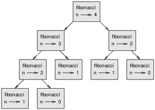

``` py
Those who cannot remember the past are condemned to repeat it.* 

                                         — Dynamic Programming
```

Dynamic programming is an algorithmic paradigm that divides broader problems into smaller subproblems and stores the result for later use, eliminating the need for any re-computation. This problem-solving approach is quite similar to the divide and conquer approach.

We solve problems in both these paradigms by integrating the answers to smaller subproblems. However, unlike divide and conquer, the subproblems in dynamic programming repeat themselves multiple times. This means dynamic programming has different properties than the divide and conquer approach. If the problem abides by properties given below, only then it can be solved using a dynamic programming paradigm:

* **Optimal Substructure:** A problem is said to have an optimal substructure if we can formulate a recurrence relation.

* **Overlapping Subproblem:**  Dynamic programming is used where the solutions of the same sub-problems are required again and again.

Dynamic programming is used because the solutions of sub-problems can be stored in a table so that it does not need to recompute again and again. Dynamic programming is not required when there are no common or overlapping sub-problems as there is no use of storing the results in a table again and again.

For example, Binary search does not require dynamic programming as it has no common sub-problems. In contrast, a recursive program of Fibonacci series has many common sub-problems, so it requires a dynamic programming approach to solve the problem optimally.

There are two ways that we can use to store the values:

* [Memoization](#memoization--top-down-approach)
* [Tabulation](#tabulation-bottom-up-approach)

Both tabulation and memoization are used to store the solutions of sub-problems. In memoization, table entry is filled on demand; it means that its not mandatory that all the entries are completely filled. In the tabulation technique, all the table entries are filled one by one starting from the very first entry.

|Top-Down Approach|Bottom-Up Approach|
|:-:|:-:|
|Uses memorization technique|Uses tabulation technique|
|Recursive nature|Iterative nature|
|Structured programming languages such as COBOL, Fortran, C|Object-oriented programming languages |
|Uses decomposition|Uses composition|
|A lookup table is maintained and checked before computation of any subproblem|The solution is built from a bottom-most case using iteration|

## Memoization : TOP-DOWN Approach

Memoization is a technique that stores the result of the sub-problem. Memoization technique is almost similar to the recursive technique with a small difference that memorization looks into the lookup table before computing the sub-problem. In the memorization technique, a lookup table is used. Initially, a look up table is initialized with NIL values. Whenever we require a solution of the sub-problem then we first look into the look up table and if we do not find the solution into the look up table then we compute the sub-problem and stores the result into the look up table so that it can be reused later.

The top-down approach follows the memorization technique. It consists of two distinct events: recursion and caching. ‘Recursion’ represents the process of computation by calling functions repeatedly, whereas ‘caching’ represents the storing of intermediate results.

- Advantages
  - Easy to understand and implement
  - Solves the subproblem only if the solution is not memorized. When not all the subproblems need to be solved, memoization means only the necessary ones are computed.
  - Debugging is easier.
- Disadvantages
  - Uses recursion, which takes up more memory space in the call stack, degrading the overall performance.Trades speed for memory.
  - Possibility of a stack overflow error.

Simple recursion:

``` py
def fibonacci(n):
    print(n)
    if n == 0:
        return 0
    elif  n == 1:
        return 1
    else:
        return fibonacci(n-1) + fibonacci(n-2)

fibonacci(4)
```
```
4
3
2
1
0
1
2
1
0
3
```
Here’s a stack graph that shows all stack frames created during this function call.

Note that these frames are not all on the stack at the same time.



``` py
known = {0:0, 1:1}

def fibonacci_memo(n):
    if n in known:
        return known[n]

    print(n)
    res = fibonacci_memo(n-1) + fibonacci_memo(n-2)
    known[n] = res
    return res

fibonacci_memo(4)
```
```
4
3
2
3
```

known is a dictionary that keeps track of the Fibonacci numbers we already know. It starts with two items: 0 maps to 0 and 1 maps to 1.

Whenever fibonacci is called, it checks known. If the result is already there, it can return immediately. Otherwise it has to compute the new value, add it to the dictionary, and return it.

If you run this version of fibonacci and compare it with the original, you will find that it is much faster.

### Complexity

**Time Complexity:** Time Complexity is defined as the number of times a particular instruction set is executed rather than the total time is taken. It is because the total time took also depends on some external factors like the compiler used, processor’s speed, etc.

**Space Complexity:** Space Complexity is the total memory space required by the program for its execution.

Both are calculated as the function of input size(n).

One important thing here is that in spite of these parameters the efficiency of an algorithm also depends upon the nature and size of the input. 

``` py
import time
from functools import lru_cache


def fib(n):
    """
    Returns the n-th Fibonacci number.
    """
    if n == 0 or n == 1:
        return n
    return fib(n - 1) + fib(n - 2)


@lru_cache(maxsize=32)
def fib_lru(n):
    """
    Returns the n-th Fibonacci number.
    """
    if n == 0 or n == 1:
        return n
    return fib_lru(n - 1) + fib_lru(n - 2)


# Manual caching using a dictionary.
def fib_cache(n, cache=None):
    if cache is None:
        cache = {}
    if n in cache:
        return cache[n]
    if n == 0 or n == 1:
        return n
    result = fib_cache(n - 1, cache) + fib_cache(n - 2, cache)
    cache[n] = result
    return result


n = 35

start = time.perf_counter()
fib(n)
end = time.perf_counter()
print("Plain recursive version. Seconds taken: {:.7f}".format(end - start))

start = time.perf_counter()
fib_lru(n)
end = time.perf_counter()
print("lru cache version. Seconds taken: {:.7f}".format(end - start))

start = time.perf_counter()
fib_cache(n)
end = time.perf_counter()
print("Manual cache version. Seconds taken: {:.7f}".format(end - start))
```
```
Plain recursive version. Seconds taken: 4.4927939
lru cache version. Seconds taken: 0.0000846
Manual cache version. Seconds taken: 0.0000724
```

### Recursion limit

+ Use sys.setrecursionlimit() to set the maximum depth of the Python interpreter stack to the integer value required for the program.
+ It will raise a Recursion Error exception if the new limit is too low at the current recursion depth.

``` py
# Python3 program to explain the sys.setrecursionlimit() method

import sys

# Print the current recursion limit
# using sys.getrecursionlimit()
print("Original recursion limit was: ")
print(sys.getrecursionlimit())

# Set a new recursion limit
sys.setrecursionlimit(10**6)

# Print the new recursion limit
print("New recursion limit is: ")
print(sys.getrecursionlimit())

```
```
Original recursion limit was: 
1000
New recursion limit is: 
1000000
```

## Tabulation: BOTTOM-UP Approach

In the tabulation technique, we solve the sub-problems in a bottom-up fashion and use the solutions of sub-problems to reach at the bigger sub-problems. The tabulation technique can be used as generating the solutions of bigger sub-problems iteratively by using the solutions of the smaller sub-problems.

It addresses the same problems as before, but without recursion. The recursion is replaced with iteration in this approach. Hence, there is no stack overflow error or overhead of recursive procedures. We maintain a table (e.g. 3D matrix) to solve the problem in this method.

``` py
# Fibonacci using the bottom up approach
def fib(n):
    a = 1  # f(i - 2)
    b = 1  # f(i - 1)
    for i in range(2, n + 1):  # end of range is exclusive
        # the old "a" is no longer accessible after this
        a, b = b, a + b

    return b
```
``` py
import time
start = time.perf_counter()
fib(35)
end = time.perf_counter()
print("Bottum-up version. Seconds taken: {:.7f}".format(end - start))
```

```
Bottum-up version. Seconds taken: 0.0000956
```

Both memoization and bottom-up approach are linear in time for calculation. Though the bottom-up approach is faster in a constant factor. The big difference is in memory usage. Bottom-up approach uses a small constant space, while recursion needs a linear space.

Bottom up approach represent recursive problems as a Directed acyclic graphs (DAGs). The Dag can be traversed in order of dependency, solving sobproblems before they are needed and using minimal time and space.

``` py
from tabulate import tabulate


def knapsack(max_capacity, weights, values):
    num_items = len(values)
    results_table = [[0 for _ in range(max_capacity + 1)] for _ in range(num_items + 1)]

    # Build results table in bottom-up manner
    for i in range(num_items + 1):
        for j in range(max_capacity + 1):
            # This initial empty rows and columns
            if i == 0 or j == 0:
                results_table[i][j] = 0
            # The rest of the cells
            elif weights[i - 1] <= j:
                results_table[i][j] = max(results_table[i - 1][j], values[i - 1]
                                          + results_table[i - 1][j - weights[i - 1]])
            else:
                results_table[i][j] = results_table[i - 1][j]

    # Display results table
    print(tabulate(results_table, tablefmt="pretty"))

    # for row in results_table:
    #     for el in row:
    #         print(el, end=",")
    #     print()

    return results_table[num_items][max_capacity]


values = [10, 5, 20, 35]
weights = [1, 2, 3, 5]
max_capacity = 6

print(knapsack(max_capacity, weights, values))
```
```
+---+----+----+----+----+----+----+
| 0 | 0  | 0  | 0  | 0  | 0  | 0  |
| 0 | 10 | 10 | 10 | 10 | 10 | 10 |
| 0 | 10 | 10 | 15 | 15 | 15 | 15 |
| 0 | 10 | 10 | 20 | 30 | 30 | 35 |
| 0 | 10 | 10 | 20 | 30 | 35 | 45 |
+---+----+----+----+----+----+----+
45
```

+ Dynamic programming is useful when you’re trying to optimize
something given a constraint. In the knapsack problem, you had to
maximize the value of the goods you stole, constrained by the size of
the knapsack.
+ You can use dynamic programming when the problem can be broken
into discrete subproblems, and they don’t depend on each other

* Every dynamic-programming solution involves a grid.
* The values in the cells are usually what you’re trying to optimize.

* Each cell is a subproblem, so think about how you can divide
your problem into subproblems. That will help you figure out what
the axes are

References:

Useful [Youtube video](https://www.youtube.com/watch?v=oBt53YbR9Kk)

[Other](https://www.youtube.com/watch?v=yfTlyYTnfKM)

### **Convert to an Iterative Approach:**
+ Any problem of recursion can be converted to an iterative approach, so try to use the iterative approach instead of recursion.
+ Using Stack and while loop may save the execution time of the program.

``` py
# Program to show the time taken in
# iteration and recursion
  
import time
  
# Recursive function to find factorial
# of the given number N
def factorial(N):
    
      # Base Case
    if N == 0:
        return 1
        
    # Recursive Call
    return N * factorial(N - 1)
  
# Driver Code
if __name__ == '__main__':
    n = 20
  
    # Find the time taken for the
    # recursive approach
    start = time.perf_counter()
    print("Calculated using recursion: ", factorial(n))
      
    end = time.perf_counter()
    print("Time taken in recursion: ", "{0:.9f}".format(end-start))
  
    # Find time taken for iterative
    # approach
    start = time.perf_counter()
    result = 1
      
    while n > 0:
        result *= n
        n -= 1
          
    print("Calculated using the iterative method: ", result)
      
    end = time.perf_counter()
    print("Time taken in iteration: ", "{0:.9f}".format(end-start))
```
```
Calculated using recursion:  2432902008176640000
Time taken in recursion:  0.004770568
Calculated using the iterative method:  2432902008176640000
Time taken in iteration:  0.000037236
```