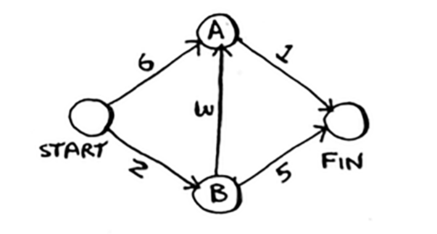

## Kruskal Algorithm


## Dijkstra’s Algorithm

1. Find the cheapest node. This is the node you can get to in the least
amount of time.
2. Check whether there’s a cheaper path to the neighbors of this node.
If so, update their costs.
3. Repeat until you’ve done this for every node in the graph.
4. Calculate the final path.



``` py
#To code this example, you’ll need three hash tables. graph, cost and parents

graph = {}
graph['start'] = {}
graph['start']['a'] = 6
graph['start']['b'] = 2
graph['a'] = {}
graph['a']['fin'] = 1
graph['b'] = {}
graph['b']['a'] = 3
graph['b']['fin'] = 5
graph['fin'] = {}

infinity = float('inf')
costs = {}
costs['a'] = 6
costs['b'] = 2
costs['fin'] = infinity

parents = {}
parents['a'] = 'start'
parents['b'] = 'start'
parents['fin'] = None

# an array to keep track of all the nodes you’ve already
# processed, because you don’t need to process a node more than once
processed = []

def find_lowest_cost_node(costs):
  lowest_cost = float('inf')
  lowest_cost_node = None
  for node in costs: #Go through each node.
    cost = costs[node]
    if cost < lowest_cost and node not in processed:
      lowest_cost = cost #… set it as the new lowest-cost node.
      lowest_cost_node = node
  return lowest_cost_node

node = find_lowest_cost_node(costs)
while node is not None:
  cost = costs[node]
  neighbors = graph[node]
  for n in neighbors.keys():
    new_cost = cost + neighbors[n]
    if costs[n] > new_cost:
      costs[n] = new_cost
      parents[n] = node
  processed.append(node)
  node = find_lowest_cost_node(costs)

print(costs)
```
```
{'a': 5, 'b': 2, 'fin': 6}
```

Bellman Ford Algorithm

Topological Sort Algorithm

Floyd-Warshall Algorithm

Flood Fill Algorithm

Lee Algorithm