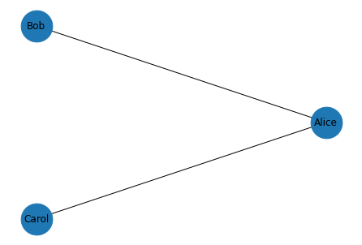
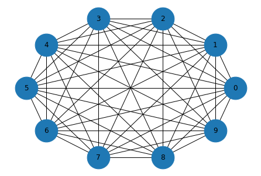
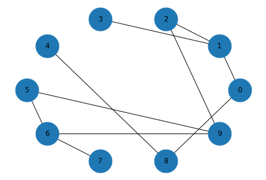
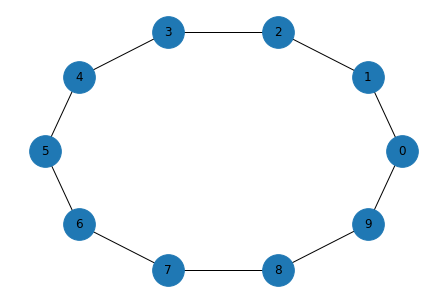

Graphs are used to represent many real-life applications like networks, transportation paths of a city, and social network connections.

A graph is a set of connected nodes where each node is called a Vertex and the connection between two of them is called an Edge.

A graph can be represented using a square matrix, where each element represents the edges: 0 indicates no edge, while 1 indicates an edge. The rows and columns represent the vertices. This type of matrix is called an adjacency matrix, because it shows if the corresponding vertices are adjacent or not.

``` py
class Graph():
  def __init__(self,size):
    self.adj = [ [0] * size for i in range(size)]
    self.size = size
  def add_edge(self, orig, dest):
    if orig > self.size or dest > self.size or orig < 0 or dest < 0:
      print("Invalid Edge")
    else:
      self.adj[orig-1][dest-1] = 1
      self.adj[dest-1][orig-1] = 1
  def remove_edge(self, orig, dest):
    if orig > self.size or dest > self.size or orig < 0 or dest < 0:
      print("Invalid Edge")
    else:
      self.adj[orig-1][dest-1] = 0
      self.adj[dest-1][orig-1] = 0
  def display(self):
    for row in self.adj:
      print()
      for val in row:
        print('{:4}'.format(val),end="")      

```
A graph is a collection of nodes and edges, where nodes often represent objects or ideas, and edges represent relationships among them. For example, in a graph that represents a social network, nodes might represent people and edges might represent friendships between them.

NetworkX provides data structures to represent graphs and function that implement graph algorithms. To show how it works, we’ll make a small graph that represents a social network.

Here’s how we make a graph and add nodes.

``` py
import networkx as nx

G = nx.Graph()
G.add_node('Alice')
G.add_node('Bob', age=23)
G.add_node('Carol', cat='mittens')
list(G.nodes())
```
```
['Alice', 'Bob', 'Carol']
```
Optionally, you can provide attributes that are associated with the node. In this example, Bob has an age attribute and Carol has a cat.

Here’s how we add edges between nodes.

``` py
G.add_edge('Alice', 'Bob')
G.add_edge('Alice', 'Carol', type='enemy')
list(G.edges())
```
```
[('Alice', 'Bob'), ('Alice', 'Carol')]
```
Optionally, you can provide attributes that are associated with the edge. In this example, the second edge has an attribute called type that indicates the nature of the relationship.

Here’s how to draw the graph.

``` py
def draw_graph(G):
    nx.draw_circular(G, node_size=1500, with_labels=True)

draw_graph(G)
```


## Graph Representation

NetworkX represents graphs using a dictionary that maps from each node to a dictionary that maps from nodes to edges.

If we select an element from the top-level dictionary, the result is a dictionary-like object.

``` py
G['Alice']
```
```
AtlasView({'Bob': {}, 'Carol': {'type': 'enemy'}})
```
So we can iterate through the neighbors of a node like this:

``` py
for neighbor in G['Alice']:
    print(neighbor)
```
```
Bob
Carol
```
Or enumerate the neighbors and edges like this:

``` py
for key, value in G['Alice'].items():
    print(key, value)
```
```
Bob {}
Carol {'type': 'enemy'}
```
Edges are represented by dictionaries of attributes. In this example, the first edge has no attributes and the second has an attribute named type.

We can select an edge like this:

``` py
G['Alice']['Carol']
```
```
{'type': 'enemy'}
```
To check whether there is an edge from one node to another, we can use the in operator:

``` py
def has_edge(G, u, v):
    return v in G[u]

has_edge(G, 'Alice', 'Bob')
```
```
True
```
But there’s a method that does the same thing.

``` py
G.has_edge('Alice', 'Bob')
```
```
True
```
## Complete Graphs

In a complete graph, all nodes are connected to each other. To make a complete graph, we’ll use the following generator function, iterates through all pairs of nodes.

``` py
def all_pairs(nodes):
    for i, u in enumerate(nodes):
        for j, v in enumerate(nodes):
            if i < j:
                yield u, v
```

Here’s a complete graph with 10 nodes:

``` py
def make_complete_graph(n):
    nodes = range(n)
    G = nx.Graph()
    G.add_nodes_from(nodes)
    G.add_edges_from(all_pairs(nodes))
    return G
```

``` py
complete = make_complete_graph(10)
```
And here’s what it looks like.

``` py
draw_graph(complete)
```

## Random Graphs

Next we’ll make an Erdos-Renyi graph, which is a random graph where the probability of an edge between each pair of nodes is .

The helper function flip returns True with probability p and False with probability 1-p

``` py
import random

def flip(p):
    return random.random() < p
```
random_pairs is a generator function that enumerates all possible pairs of nodes and yields each one with probability p

``` py
def random_pairs(nodes, p):
    for edge in all_pairs(nodes):
        if flip(p):
            yield edge
```
make_random_graph makes an ER graph where the probability of an edge between each pair of nodes is p.

``` py
def make_random_graph(n, p):
    nodes = range(n)
    G = nx.Graph()
    G.add_nodes_from(nodes)
    G.add_edges_from(random_pairs(nodes, p))
    return G
```
Here’s an example with n=10 and p=0.3

``` py
random_graph = make_random_graph(10, 0.3)
len(random_graph.edges())
```
```
10
```
And here’s what it looks like:
``` py
draw_graph(random_graph)
```



## Connectivity

A graph is connected if you can start from any node and follow a sequence of edges to reach any other node.

To check whether a graph is connected, we’ll use a version of a depth-first search.

For most graphs, the basic version of DFS runs forever, because it visits the same nodes over and over. The solution is to keep track of the nodes we’ve seen and avoid visiting them more than once.

In the complete graph, starting from node 0, we can reach all nodes.

In a random graph, it may or may not be possible to reach all nodes.

## Watts-Strogatz Graphs

A Watts-Strogatz (WS) graph is a random graph, like an Erdos-Renyi graph, but the construction process is different. A WS graph starts with a ring lattice and randomly “rewires” some of the edges.

NetworkX provides a function that makes a WS graph, so we can see what it looks like.

Here’s an example with n=10 nodes, each connected to k=2 neighbors, with probability p=0 of rewiring each edge.

``` py
import networkx as nx

G = nx.watts_strogatz_graph(n=10, k=3, p=0)
G.nodes()
```
```
NodeView((0, 1, 2, 3, 4, 5, 6, 7, 8, 9))
```
The result is a ring where each node holds hands with its immediate neighbors.

``` py
def draw_graph(G):
    nx.draw_circular(G, node_size=1000, with_labels=True)

draw_graph(G)
```



Note: If k is odd, it gets “rounded down” to an even number.

## Depth-First Search

``` py
def reachable_nodes(G, start):
    seen = set()
    stack = [start]
    while stack:
        node = stack.pop()
        if node not in seen:
            seen.add(node)
            stack.extend(G[node])
    return seen

reachable_nodes(G, 0)
```
```
{0, 1, 2, 3, 4, 5, 6, 7, 8, 9}
```

## Fast Breadth-First Search

NetworkX provides a simple, fast implementation of BFS, available from the NetworkX repository on GitHub. Here is a version I modified to return a set of nodes:

``` py
def plain_bfs(G, start):
    seen = set()
    nextlevel = {start}
    while nextlevel:
        thislevel = nextlevel
        nextlevel = set()
        for v in thislevel:
            if v not in seen:
                seen.add(v)
                nextlevel.update(G[v])
    return seen


```
Let’s compare this function to reachable_nodes_bfs and see which is faster.

``` py
G = nx.watts_strogatz_graph(1000, 10, 0.01)

%timeit plain_bfs(G, 0)
```
```
100 loops, best of 5: 1.98 ms per loop

```