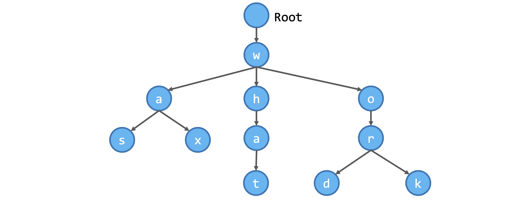
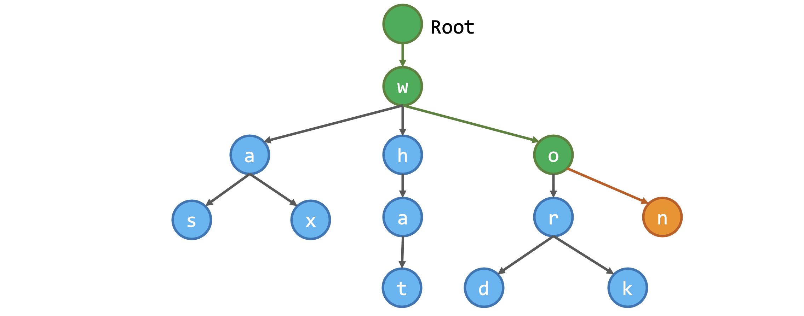
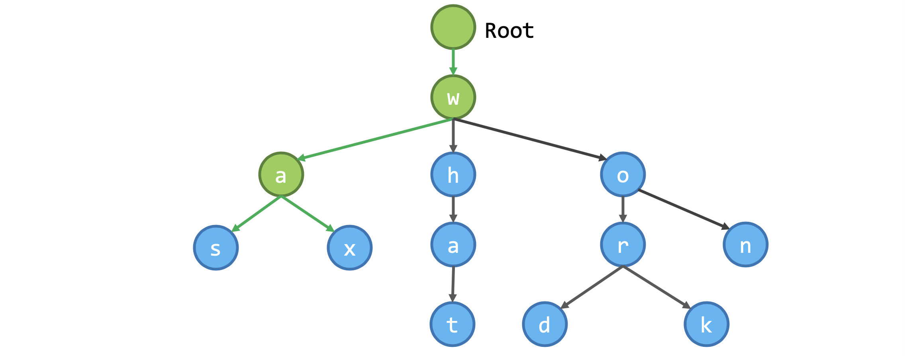

Trie is a tree-like data structure made up of nodes. Nodes can be used to store data. Each node may have none, one or more children. When used to store a vocabulary, each node is used to store a character, and consequently each "branch" of the trie represents a unique word. The following figure shows a trie with five words (was, wax, what, word, work) stored in it.



There are two major operations that can be performed on a trie, namely:

1. [Inserting a word into the Trie](#inserting-words-into-the-trie)

2. [Searching for words using a prefix](#searching-in-the-trie)

## Inserting Words into the Trie

In order to insert a new word into the trie, we need to first check whether any prefix of the word is already in the trie. Therefore, we will start traverse the trie from the root node, and follow the algorithm below:

1. Set the current node to be the root node
2. Set the current character as the first character of the input word
3. Check if the current character is a child of the current node
If yes, set the current node to be this child node, set the current character to the next character in the input word, and perform this step again
If no, it means from this character onwards, we will need to create new nodes and insert them into the trie

Below is an illustration of what will happen when we want to add the word won into the trie above.



Following the steps in the algorithm mentioned above, we will arrive at the node o under w, at which point we discover that n is not a child of o, and therefore we create a new node for the character n, and insert it under o.

## Searching in the Trie
A common application scenario of the trie data structure is to search for words with a certain prefix, just like the auto-complete or query suggestion function in a search bar.

When given a prefix, we can traverse the trie to check if any word in the trie starts with that prefix. If the prefix is found in the trie, we can then use depth-first traversal to retrieve all the words with that prefix.

For example, given the trie illustrated above, which contains the words was, wax, what, word, work and won, let's see what will happen if we want to search for words with the prefix wa:



1. Starting from the root node, we are able to find the node w and a
2. From the node a, we can go on to traverse the trie to retrieve all words starting with the prefix wa
3. When we arrive at the node s, we check whether it is the end of a word (yes), and the word was was output
4. Similarity, when we arrive at the node x, the word wax is output

## Implementation

``` py
class TrieNode:
    """A node in the trie structure"""

    def __init__(self, char):
        # the character stored in this node
        self.char = char

        # whether this can be the end of a word
        self.is_end = False

        # a counter indicating how many times a word is inserted
        # (if this node's is_end is True)
        self.counter = 0

        # a dictionary of child nodes
        # keys are characters, values are nodes
        self.children = {}
```
In this implementation, we want to store also the number of times a word has been inserted into the trie. This allows us to support additional features, such as ranking the words by their popularity.

``` py
class Trie(object):
    """The trie object"""

    def __init__(self):
        """
        The trie has at least the root node.
        The root node does not store any character
        """
        self.root = TrieNode("")
    
    def insert(self, word):
        """Insert a word into the trie"""
        node = self.root
        
        # Loop through each character in the word
        # Check if there is no child containing the character, create a new child for the current node
        for char in word:
            if char in node.children:
                node = node.children[char]
            else:
                # If a character is not found,
                # create a new node in the trie
                new_node = TrieNode(char)
                node.children[char] = new_node
                node = new_node
        
        # Mark the end of a word
        node.is_end = True

        # Increment the counter to indicate that we see this word once more
        node.counter += 1
        
    def dfs(self, node, prefix):
        """Depth-first traversal of the trie
        
        Args:
            - node: the node to start with
            - prefix: the current prefix, for tracing a
                word while traversing the trie
        """
        if node.is_end:
            self.output.append((prefix + node.char, node.counter))
        
        for child in node.children.values():
            self.dfs(child, prefix + node.char)
        
    def query(self, x):
        """Given an input (a prefix), retrieve all words stored in
        the trie with that prefix, sort the words by the number of 
        times they have been inserted
        """
        # Use a variable within the class to keep all possible outputs
        # As there can be more than one word with such prefix
        self.output = []
        node = self.root
        
        # Check if the prefix is in the trie
        for char in x:
            if char in node.children:
                node = node.children[char]
            else:
                # cannot found the prefix, return empty list
                return []
        
        # Traverse the trie to get all candidates
        self.dfs(node, x[:-1])

        # Sort the results in reverse order and return
        return sorted(self.output, key=lambda x: x[1], reverse=True)
```

Below is an example of how this Trie class can be used:

``` py
t = Trie()
t.insert("was")
t.insert("word")
t.insert("war")
t.insert("what")
t.insert("where")
t.query("wh")
```
```
[('what', 1), ('where', 1)]
```

### using DefaultDict

``` py
_end = '_end_'

def make_trie(*words):
  root = dict()
  for word in words:
    current_dict = root
    for letter in word:
      current_dict = current_dict.setdefault(letter, {})
    current_dict[_end] = _end
  return root

make_trie('foo', 'bar', 'baz', 'barz')
```
```
{'b': {'a': {'r': {'_end_': '_end_', 'z': {'_end_': '_end_'}},
   'z': {'_end_': '_end_'}}},
 'f': {'o': {'o': {'_end_': '_end_'}}}}
```

setdefault() simply looks up a key in the dictionary (here, letter or _end). If the key is present, it returns the associated value; if not, it assigns a default value to that key and returns the value ({} or _end). (It's like a version of get that also updates the dictionary.)

``` py
def in_trie(trie, word):
  current_dict = trie
  for letter in word:
        if letter not in current_dict:
            return False
        current_dict = current_dict[letter]
  return _end in current_dict
```
``` py
in_trie(make_trie('foo', 'bar', 'baz', 'barz'), 'baz')
```
```
True 
```
``` py
in_trie(make_trie('foo', 'bar', 'baz', 'barz'), 'barzz')
```
```
False
```