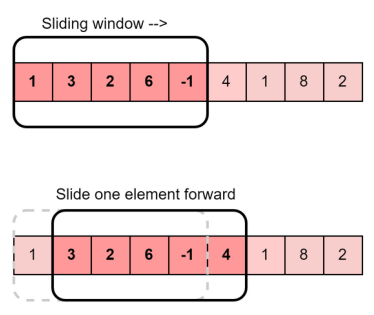
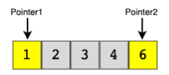
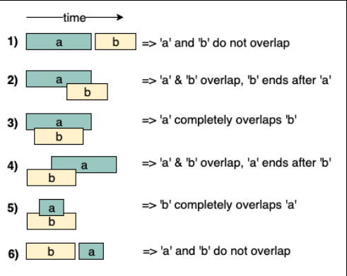

## Window Sliding



* Usage:

This algorithmic technique is used when we need to handle the input data in a specific window size. Window Sliding Technique is a computational technique which aims to reduce the use of nested loop and replace it with a single loop, thereby reducing the time complexity.

* DS involved: 

Array, String, Hashtable

* Sample Problems:

        - Longest substring with 'K' distinct chracters
        - Fruits into Baskets

* Example :

Given an array of integers of size ‘n’, Our aim is to calculate the maximum sum of ‘k’ consecutive elements in the array.

Input  : arr[] = {100, 200, 300, 400}, k = 2
Output : 700

Input  : arr[] = {1, 4, 2, 10, 23, 3, 1, 0, 20}, k = 4 
Output : 39
We get maximum sum by adding subarray {4, 2, 10, 23} of size 4.

Input  : arr[] = {2, 3}, k = 3
Output : Invalid
There is no subarray of size 3 as size of whole array is 2.

**Brute Force Approach**

We start with first index and sum till k-th element. We do it for all possible consecutive blocks or groups of k elements. This method requires nested for loop, the outer for loop starts with the starting element of the block of k elements and the inner or the nested loop will add up till the k-th element.

Consider the below implementation :
``` py
# code
import sys
  
# O(n * k) solution for finding
# maximum sum of a subarray of size k
INT_MIN = -sys.maxsize - 1
  
# Returns maximum sum in a
# subarray of size k.
  
  
def maxSum(arr, n, k):
  
    # Initialize result
    max_sum = INT_MIN
  
    # Consider all blocks
    # starting with i.
    for i in range(n - k + 1):
        current_sum = 0
        for j in range(k):
            current_sum = current_sum + arr[i + j]
  
        # Update result if required.
        max_sum = max(current_sum, max_sum)
  
    return max_sum
  
  
# Driver code
arr = [1, 4, 2, 10, 2,
       3, 1, 0, 20]
k = 4
n = len(arr)
print(maxSum(arr, n, k))
```
```
24
```
It can be observed from the above code that the time complexity is O(k*n) as it contains two nested loops.

**Sliding Window Technique**

The technique can be best understood with the window pane in bus, consider a window of length n and the pane which is fixed in it of length k. Consider, initially the pane is at extreme left i.e., at 0 units from the left. Now, co-relate the window with array arr[] of size n and pane with current_sum of size k elements. Now, if we apply force on the window such that it moves a unit distance ahead. The pane will cover next k consecutive elements.

Applying sliding window technique :

We compute the sum of first k elements out of n terms using a linear loop and store the sum in variable window_sum. Then we will graze linearly over the array till it reaches the end and simultaneously keep track of maximum sum. To get the current sum of block of k elements just subtract the first element from the previous block and add the last element of the current block . The below representation will make it clear how the window slides over the array.

``` py
# O(n) solution for finding
# maximum sum of a subarray of size k


def maxSum(arr, k):
	# length of the array
	n = len(arr)

	# n must be greater than k
	if n < k:
		print("Invalid")
		return -1

	# Compute sum of first window of size k
	window_sum = sum(arr[:k])

	# first sum available
	max_sum = window_sum

	# Compute the sums of remaining windows by
	# removing first element of previous
	# window and adding last element of
	# the current window.
	for i in range(n - k):
		window_sum = window_sum - arr[i] + arr[i + k]
		max_sum = max(window_sum, max_sum)

	return max_sum


# Driver code
arr = [1, 4, 2, 10, 2, 3, 1, 0, 20]
k = 4
print(maxSum(arr, k))
```
```
24
```

## Islands (Matrix Traversal)


* Usage:

This pattern describes all the efficient ways of traversing a matrix (or 2D array)

* DS involved:

Matrix, Queue

* Sample Problems:

            - Number of Islands
            - Flood Fill
            - Cycle in a Matrix

## Two Pointers



* Usage:

This technique uses two pointers to iterate input data. Generally, both pointers move in the opposite direction at a constant interval.

* DS Involved:

Array, String, LinkedList

* Sample Problems:
  
        - Squaring a Sorted Array
        - Dutch National Flag Problem
        - Minimum Window Sort

## Fast and Slow Pointers


* Usage:

Also known as Hare & Tortoise algorithm. This technique uses two pointers that traverse the input data at different speeds.

* DS Involved:

Array, String, LinkedList

* Sample Problems:

        - Middle of the LinkedList
        - Happy Number
        - Cycle in a Ciscular Array

## Merge Intervals



* Usage:

This technique is used to deal with overlapping intervals

* DS Involved:

Array, heap

* Sample Problems:

        - Conflicting Appointements
        - Minimum Meeting Rooms

A simple approach is to start from the first interval and compare it with all other intervals for overlapping, if it overlaps with any other interval, then remove the other interval from the list and merge the other into the first interval. Repeat the same steps for the remaining intervals after the first. This approach cannot be implemented in better than O(n^2) time.

The idea to solve this problem is, first sort the intervals according to the starting time. Once we have the sorted intervals, we can combine all intervals in a linear traversal. The idea is, in sorted array of intervals, if interval[i] doesn’t overlap with interval[i-1], then interval[i+1] cannot overlap with interval[i-1] because starting time of interval[i+1] must be greater than or equal to interval[i].

- Sort the intervals based on the increasing order of starting time.
- Push the first interval into a stack.
- For each interval do the following:
  - If the current interval does not overlap with the top of the stack then, push the current interval into the stack.
  - If the current interval overlap with the top of the stack then, update the stack top with the ending time of the current interval.
- The end stack contains the merged intervals. 

``` py
def mergeIntervals(intervals):
	# Sort the array on the basis of start values of intervals.
	intervals.sort()
	stack = []
	# insert first interval into stack
	stack.append(intervals[0])
	for i in intervals[1:]:
		# Check for overlapping interval,
		# if interval overlap
		if stack[-1][0] <= i[0] <= stack[-1][-1]:
			stack[-1][-1] = max(stack[-1][-1], i[-1])
		else:
			stack.append(i)

	print("The Merged Intervals are :", end=" ")
	for i in range(len(stack)):
		print(stack[i], end=" ")


arr = [[6, 8], [1, 9], [2, 4], [4, 7]]
mergeIntervals(arr)
```
```
The Merged Intervals are : [1, 9] 
```

**Time complexity:** 

O(N*log(N)) 

**Auxiliary Space:** 

O(N)

The above solution requires O(n) extra space for the stack. We can avoid the use of extra space by doing merge operations in place. Below are detailed steps.

1. Sort all intervals in increasing order of start time.
2. Traverse sorted intervals starting from the first interval, 
3. Do the following for every interval.
    - If the current interval is not the first interval and it overlaps with the previous interval, then merge it with the previous interval. Keep doing it while the interval overlaps with the previous one.         
    - Otherwise, Add the current interval to the output list of intervals.

``` py
# Python program to merge overlapping Intervals in
# O(n Log n) time and O(1) extra space


def mergeIntervals(arr):

	# Sorting based on the increasing order
	# of the start intervals
	arr.sort(key=lambda x: x[0])

	# Stores index of last element
	# in output array (modified arr[])
	index = 0

	# Traverse all input Intervals starting from
	# second interval
	for i in range(1, len(arr)):

		# If this is not first Interval and overlaps
		# with the previous one, Merge previous and
		# current Intervals
		if (arr[index][1] >= arr[i][0]):
			arr[index][1] = max(arr[index][1], arr[i][1])
		else:
			index = index + 1
			arr[index] = arr[i]

	print("The Merged Intervals are :", end=" ")
	for i in range(index+1):
		print(arr[i], end=" ")


# Driver code
arr = [[6, 8], [1, 9], [2, 4], [4, 7]]
mergeIntervals(arr)

```
```
The Merged Intervals are : [1, 9] 
```
**Time Complexity:** 

O(N*log(N))

**Auxiliary Space Complexity:**

O(1)

## Cyclic Sort

* Usage:

Use this technique to solve array problems where the input data lies within a fixed range.

* DS involved:

Array

* Sample Problems:

        - Find all Missing Numbers
        - Find all Duplicate Numbers
        - Find the first K Missing Positive Numbers

## In-place Reversal of a LinkedList

* Usage: 

This technique describes an efficient
way to reverse the links between a set of nodes
of a LinkedList. Often, the constraint is that we
need to do this in-place, i.e., using the existing
node objects and without using extra memory.

* DS involved: 

LinkedList

* Sample Problems: 

        - Reverse every K-element Sub-list
        - Rotate a LinkedList

## Depth-First Search

* Usage: 

This technique is used to solve
problems involving traversing trees or graphs in
a depth-first search manner.

* DS involved: 

Tree, Graph, Matrix

* Sample Problems: 

        - Path With Given Sequence
        - Count Paths for a Sum

## Breadth First Search

Usage: 

This technique is used to solve problems involving traversing trees or graphs in a breadth-first search manner.

DS involved: 

Tree, Graph, Matrix, Queue

Sample Problems:

        - Binary Tree Level Order Traversal
        - Minimum Depth of a Binary Tree
        - Connect Level Order Siblings

## Two Heaps

* Usage: 

In many problems, we are given a set of
elements that can be divided into two parts. We
are interested in knowing the smallest element
in one part and the biggest element in the other
part. As the name suggests, this technique uses
a Min-Heap to find the smallest element and a
Max-Heap to find the biggest element.

* DS involved: 

Heap, Array

* Sample Problems: 

        - Find the Median of a Number Stream
        - Next Interval

## Subsets

Usage: 

Use this technique when the problem asks to deal with permutations or combinations of a set of elements

DS involved: 

Queue, Array, String

Sample Problems:

        - String Permutations by changing case
        - Unique Generalized Abbreviations

## Modified Binary Search

Usage: 

Use this technique to search a sorted set of elements efficiently.

DS involved: 

Array

Sample Problems:

        - Ceiling of a Number
        - Bitonic Array Maximum

## Bitwise XOR

* Usage: 

This technique uses the XOR operator
to manipulate bits to solve problems.

* DS involved: 

Array, Bits

* Sample Problems: 

        - Two Single Numbers
        - Flip and Invert an Image

## Top 'K' Elements

Usage: 

This technique is used to find top/smallest/frequently occurring ‘K’ elements in a set.

DS involved: 

Array, Heap, Queue

Sample Problems:

        - ‘K’ Closest Points to the Origin
        - Maximum Distinct Elements

## K-way Merge

Usage: 

This technique helps us solve problems that involve a list of sorted arrays.

DS involved: 

Array, Queue, Heap

Sample Problems:

        - Kth Smallest Number in M Sorted Lists
        - Kth Smallest Number in a Sorted Matrix

## Topological Sort

Usage: 

Use this technique to find a linear ordering of elements that have dependencies on each other.

DS involved: 

Array, HashTable, Queue, Graph

Sample Problems:

        - Tasks Scheduling
        - Alien Dictionary

## 0/1 Knapsack

Usage: 

This technique is used to solve optimization problems. Use this technique to select elements that give maximum profit from a given set with a limitation on capacity and that each element can only be picked once.

DS involved: 

Array, HashTable

Sample Problems:

        - Equal Subset Sum Partition
        - Minimum Subset Sum Difference

## Fibonacci Numbers

Usage: 

Use this technique to solve problems that follow the Fibonacci numbers sequence, i.e., every subsequent number is calculated from the last few numbers.

DS involved: 

Array, HashTable

Sample Problems:

        - Staircase
        - House Thief

## Palindromic Subsequence

Usage: 

This technique is used to solve optimization problems related to palindromic sequences or strings.

DS involved: 

Array, HashTable

Sample Problems:

        - Longest Palindromic Subsequence
        - Minimum Deletions in a String to make it a Palindrome

## Longest Common Substring

Usage: 

Use this technique to find the optimal part of a string/sequence or set of strings/sequences.

DS involved: 

Array, HashTable

Sample Problems:

        - Maximum Sum Increasing Subsequence
        - Edit Distance