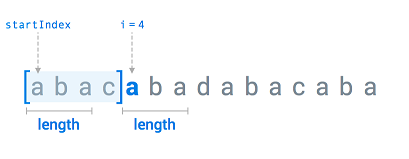
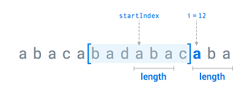

## Incorrect Password Attempts

5 min - Easy

One Very Important User (VIU) has a Very Confidential Document (VCD) stored on his Dropbox account. He doesn't let anyone see the VCD, especially his roommates who often have access to his devices.

Opening the Dropbox mobile app on the VIU's tablet requires a four-digit passcode. To ensure the confidentiality of the stored information, the device is locked out of Dropbox after 10 consecutive failed passcode attempts. We need to implement a function that, given an array of attempts made throughout the day and the correct passcode, checks to see if the device should be locked, i.e. 10 or more consecutive failed passcode attempts were made.

**Example**

For
passcode = "1111" and
```
attempts = ["1111", "4444",
            "9999", "3333",
            "8888", "2222",
            "7777", "0000",
            "6666", "7285",
            "5555", "1111"]
```
the output should be
solution(passcode, attempts) = true.

The first attempt is correct, so the user must have successfully logged in. However, the next 10 consecutive attempts are incorrect, so the device should be locked. Thus, the output should be true.

For
passcode = "1234" and
```
attempts = ["9999", "9999",
            "9999", "9999",
            "9999", "9999",
            "9999", "1234",
            "9999", "9999",
            "9999", "9999"]
```

the output should be
solution(passcode, attempts) = false.

There are only 9 consecutive incorrect attempts, so there's no need to lock the device.

<details>
  <summary>Click me for proposed solution</summary>

``` py

def solution(passcode, attempts):
    cnt = 0
    for a in attempts:
        failed = False
        if a!=passcode:
            cnt+=1
            failed = True
        if cnt == 10:
            return True
        if not failed:
            cnt =0
    return False
```

</details>

## Campus Cup

10 min - Medium

Dropbox holds a competition between schools called CampusCup. If you verify an email address from a college, university, or higher education institution, you earn 20 points toward your school's overall ranking. When a school receives at least 100 points, all of its registered members receive an additional 3 Gb of bonus space each. When the school receives at least 200 points, its registered members receive an additional 8 Gb. If the school receives at least 300 points, its members receive an additional 15 Gb. And finally, when a school receives at least 500 points, members receive an additional 25 Gb each.

You are given n registered emails, all of them unique. Each email has the following format: "<name>@<domain>", where <name> and <domain> are non-empty strings consisting of lowercase letters and a '.'. Identical domains correspond to the same school and vice versa.

Your task is to make a scoreboard, i.e. to sort the schools according to the amount of bonus space they each received (per student not in total). School A must be higher in the standings than school B if A received more space than B, or if they received equal number of gigabytes but the domain string of school A is lexicographically smaller than the one of school B.

Example

For emails = ["john.doe@mit.edu", "admin@rain.ifmo.ru", "noname@mit.edu"], the output should be
solution(emails) = ["mit.edu", "rain.ifmo.ru"].

"mit.edu" scored 40 points, and "rain.ifmo.ru" just 20. Both universities got no additional space, so "mit.edu" must be higher in the standings because it is lexicographically smaller than "rain.ifmo.ru".

For
```
emails = ["b@harvard.edu", "c@harvard.edu", "d@harvard.edu", 
          "e@harvard.edu", "f@harvard.edu",
          "a@student.spbu.ru", "b@student.spbu.ru", "c@student.spbu.ru", 
          "d@student.spbu.ru", "e@student.spbu.ru", "f@student.spbu.ru", 
          "g@student.spbu.ru"]
```
the output should be
solution(emails) = ["harvard.edu", "student.spbu.ru"].

"harvard.edu" - 100 points, 3 Gb of additional space.
"student.spbu.ru" - 140 points, also 3 Gb of additional space.

"harvard.edu" must be higher in the standings because it is lexicographically smaller than "student.spbu.ru".

For
```
emails = ["a@rain.ifmo.ru", "b@rain.ifmo.ru", "c@rain.ifmo.ru", 
          "d@rain.ifmo.ru", "e@rain.ifmo.ru", "noname@mit.edu"]
```
the output should be
solution(emails) = ["rain.ifmo.ru", "mit.edu"].

"mit.edu" - 20 points, no additional space.
"rain.ifmo.ru" - 100 points, 3 Gb of additional space.

Therefore, "rain.ifmo.ru" must be higher in the standings.

<details>
  <summary>Click me for proposed solution</summary>

``` py
def solution(emails):
    schools = []
    scores = []
    for e in emails:
        e = e.split("@")[1]
        if e not in schools:
            schools.append(e)
            scores.append(20)
        else:
            scores[schools.index(e)] += 20
    
    five = []
    three = []
    two = []
    one = []
    none = []
    
    for i in range(len(schools)):
        if scores[i]>=500:
            five.append(schools[i])
        elif scores[i]>=300:
            three.append(schools[i])
        elif scores[i]>=200:
            two.append(schools[i])
        elif scores[i]>=100:
            one.append(schools[i])
        else:
            none.append(schools[i])
    five.sort()
    three.sort()
    two.sort()
    one.sort()
    none.sort()
    
    return five+three+two+one+none
```
</details>

## Lossless Data Compression

25 min - Medium

In its effort to push the limits of file compression, Dropbox recently developed a lossless compression algorithm for H.264 and JPEG files. Since you are thinking about applying for a job at Dropbox, you decided to experiment with simple lossless compression as part of your interview prep.

One of the most widely known approaches in the field of compression algorithms is sliding window compression. It works as follows:

Consider characters one by one. Let the current character index be i.
Take the last width characters before the current one (i.e. s[i - width, i - 1], where s[i, j] means the substring of s from index i to index j, both inclusive), and call it the window. If there are less than width characters before the current one, then you should use s[0, i - 1] as the window.
Find such startIndex and length that s[i, i + length - 1] = s[startIndex, startIndex + length - 1] and s[startIndex, startIndex + length - 1] is contained within the window. If there are several such pairs, choose the one with the largest length. If there still remains more than one option, choose the one with the smallest startIndex.
If the search was successful, append "(startIndex,length)" to the result and move to the index i + length.
Otherwise, append the current character to the result and move on to the next one.
Given a string, apply sliding window compression to it.

**Example**

For inputString = "abacabadabacaba" and width = 7, the output should be
solution(inputString, width) = "ab(0,1)c(0,3)d(4,3)c(8,3)".

Step 1: i = 0, inputString[i] = 'a', window = "". 'a' is not contained within the window, so it is appended to the result.

Step 2: i = 1, inputString[i] = 'b', window = "a". 'b' is not contained within the window, so it is appended to the result.

Step 3: i = 2, inputString[i] = 'a', window = "ab". 'a' can be found in the window. 'a' in the window corresponds to the inputString[0], so (0,1) representing the substring "a" is appended to the result.

Step 4: i = 3, inputString[i] = 'c', window = "aba". The same situation as in the first two steps.

Step 5: i = 4, inputString[i] = 'a', window = "abac". Consider startIndex = 0, length = 3. inputString[startIndex, startIndex + length - 1] = "aba" and it is contained within the window, inputString[i, i + length - 1] = "aba". Therefore, "(0,3)" should be added to the result. i += length.



Step 6: i = 7, inputString[i] = 'd', window = inputString[0, 6] = "abacaba". The same situation as in the first two steps.

Step 7: i = 8, inputString[i] = 'a', window = inputString[1, 7] = "bacabad". Consider length = 3 again. inputString[i, i + b - 1] = "aba", window[3, 5] = "aba", and it corresponds to inputString[4, 6] since inputString[0, 2] is no longer within the window. So, "(4,3)" should be appended. i += length.

Step 8: i = 11, inputString[i] = 'c', window = "abadaba". The same situation as at the first two steps.

Step 9: i = 12, inputString[i] = 'a', window = "badabac". length = 3, inputString[i, i + length - 1] = "aba", window[3, 5] = "aba", and it corresponds to inputString[8, 10]. So, "(8,3)" should be appended. i += length.



For inputString = "abacabadabacaba" and width = 8, the output should be
solution(inputString, width) = "ab(0,1)c(0,3)d(0,7)".

In both of the above examples the resulting "compressed" string becomes even longer than the initial one. In fact, sliding window compression proves to be efficient for longer inputs.

For inputString = "aaaaaaaaaaaaaaaaaaaaaaaaaaaa" and width = 12, the output should be
solution(inputString, width) = "a(0,1)(0,2)(0,4)(0,8)(4,12)".

In the last example the resulting string is one character shorter than the input one. It is the shortest possible example of the efficient work of sliding window compression. If the input contained even more letters 'a', then the effect of this approach would be even more considerable.


<details>
  <summary>Click me for proposed solution</summary>

``` py
def solution(inputString, width):
    s=inputString
    output = s[0]
    i = 1
    while i<len(s):
        window = s[max(0,i-width):i]
        ch = s[i]
        if ch not in window:
            output += ch
            i+=1
        else:
            for length in reversed(range(1,width+2)):
                for startIndex in range(max(0,i-width),i):
                    if s[startIndex:startIndex+length] in window and s[i:i+length]==s[startIndex:startIndex+length]:
                        break
                if s[startIndex:startIndex+length] in window and s[i:i+length]==s[startIndex:startIndex+length]:
                        break
            print (i,startIndex,length)
            i += length
            line = "("+str(startIndex)+","+str(length)+")"
            output += line
    
    return output
```
</details>

## File Sync Order

30 min - Hard

Dropbox uploads files one-by-one and prioritizes them based on size, starting with the smallest. This way, you don't have to worry about your smaller files getting stuck behind larger ones during transfers. At the very beginning and after each file is synchronized, Dropbox selects the next smallest file that can fit the storage limit, and starts the upload. If it's impossible to sync anything, nothing happens until a new file is added or time runs out.

Given this structure, if you only have access to Internet for a limited time period (duration seconds), some of your files might fail to sync either because you run out of time, or they don't fit the storageLimit.

Implement a function that tells you which files will be synced in duration seconds given the storageLimit.

**Example**

For
```
files = [[10, 5], 
         [10, 7],
         [8, 10],
         [2, 20]]
```
storageLimit = 20,
uploadSpeed = 2, and
duration = 100, the output should be

solution(files, storageLimit, uploadSpeed, duration) = [0, 2, 3].

There are four files to sync:

* The first one is 10 KB, and you add it to your Dropbox folder 5 seconds after launching Dropbox. It takes 10 / 2 = 5 seconds for this file to be synced.

* The second file is 10 KB. You add it to Dropbox 7 seconds after launching, and it takes 10 / 2 = 5 seconds to sync.

* The third file is 8 KB, and you add it 10 seconds after launching Dropbox. It takes 8 / 2 = 4 seconds to sync.

* The fourth and final file is 2 KB, you add it 20 seconds after launching Dropbox, and it takes 2 / 2 = 1 second to sync.

Here's what happens:

During the first 5 seconds there are no files to upload, so nothing happens.

5 seconds after launch the first file (with index 0) is added to the Dropbox folder, and the synchronization starts immediately.

7 seconds after launch the second file (with index 1) is added to the Dropbox folder, while the first file is still syncing.

Then, 10 seconds after launch two events occur simultaneously:

the first file finishes syncing;

the third file is added to the Dropbox folder;

Since the third file is smaller than the second one, it is next in line to be synced.

It takes another 4 seconds to upload the third file.

This means that 14 seconds after launch, only the first and third files have synced.

And unfortunately, since 18 KB out of 20 KB in storage has been used by the first and third files, at 10 KB the second file would put you over the storage limit of 20 KB.

However, 20 seconds after launch, the fourth file (with index 3) is added to the Dropbox folder. It fits the storage limit, so synchronization starts right away.

Finally, 21 seconds after launch, the fourth file finishes syncing.

So, after 100 seconds all files but the second one are synced.

Check out the image below for better understanding:


For
files = [[10, 5]],
storageLimit = 100,
uploadSpeed = 1, and
duration = 10, the output should be
solution(files, storageLimit, uploadSpeed, duration) = [].
There is only one file but since uploadSpeed is quite low duration is not enough to complete the upload.

