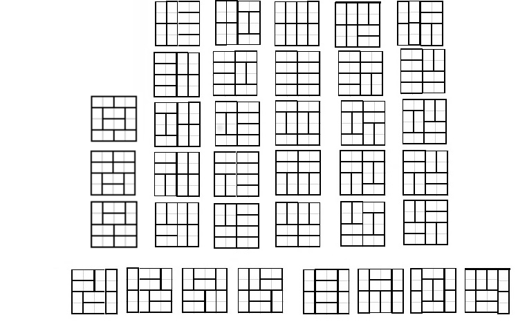

# Other Topics

## Dynamic Programming: Basic

### Climbing Stairs

Asked by Apple and Adobe - 15 min - Easy

You are climbing a staircase that has n steps. You can take the steps either 1 or 2 at a time. Calculate how many distinct ways you can climb to the top of the staircase.

**Example**

For n = 1, the output should be
solution(n) = 1;

For n = 2, the output should be
solution(n) = 2.

You can either climb 2 steps at once or climb 1 step two times.

**Solution**

``` py
def solution(n):
    a, b = 1, 0
    for _ in range(n):
        a, b = a + b, a
    return a
```
### House Robber

Asked by Linkedin - 20 min - Medium

You are planning to rob houses on a specific street, and you know that every house on the street has a certain amount of money hidden. The only thing stopping you from robbing all of them in one night is that adjacent houses on the street have a connected security system. The system will automatically trigger an alarm if two adjacent houses are broken into on the same night.

Given a list of non-negative integers nums representing the amount of money hidden in each house, determine the maximum amount of money you can rob in one night without triggering an alarm.

**Example**

For nums = [1, 1, 1], the output should be
solution(nums) = 2.

The optimal way to get the most money in one night is to rob the first and the third houses for a total of 2.

**Solutions**

``` py
def solution(nums):
    prev_max = 0
    prev_prev_max = 0
    for n in nums:
        prev_prev_max, prev_max = prev_max, max(prev_prev_max + n, prev_max)
    return prev_max
```

``` py
from functools import lru_cache

def solution(nums):
    return house(tuple(nums))

@lru_cache(maxsize=1000)
def house(nums):
    if len(nums) == 0:
        return 0
    return max(house(nums[1:]), house(nums[2:]) + nums[0])

```
### Compose Ranges

Asked by Google - 15 min - Easy

Given a sorted integer array that does not contain any duplicates, return a summary of the number ranges it contains.

**Example**

For nums = [-1, 0, 1, 2, 6, 7, 9], the output should be
solution(nums) = ["-1->2", "6->7", "9"].

**Solution**

``` py
def solution(nums):

    ranges = []
    while nums:
        start = end = nums.pop(0)
        while nums and nums[0] - end == 1:
            end = nums.pop(0)
        ranges.append(str(start) + ('', '->' + str(end))[start != end])
    return ranges
```

### Map Decoding

Asked by Microsoft, Uber and Meta - 30 min - Hard

A top secret message containing uppercase letters from 'A' to 'Z' has been encoded as numbers using the following mapping:
```
'A' -> 1
'B' -> 2
...
'Z' -> 26
```
You are an FBI agent and you need to determine the total number of ways that the message can be decoded.

Since the answer could be very large, take it modulo 109 + 7.

**Example**

For message = "123", the output should be
solution(message) = 3.

"123" can be decoded as "ABC" (1 2 3), "LC" (12 3) or "AW" (1 23), so the total number of ways is 3.

**Solution**

``` py
def solution(msg):
    a, b = 1, 0
    M = 10 ** 9 + 7
    for i in range(len(msg)-1, -1, -1):
        if msg[i] == "0":
            a, b = 0, a
        else:
            a, b = (a + (i+2 <= len(msg) and msg[i:i+2] <= "26") * b) % M, a
    return a

```

### Filling Blocks

Asked by Uber - 30 min - Hard

You have a block with the dimensions 4 × n. Find the number of different ways you can fill this block with smaller blocks that have the dimensions 1 × 2. You are allowed to rotate the smaller blocks.

**Example**

For n = 1, the output should be
solution(n) = 1.

There is only one possible way to arrange the smaller 1 × 2 blocks inside the 4 × 1 block.

For n = 4, the output should be
solution(n) = 36.

Here are the 36 possible configuration of smaller blocks inside the 4 × 4 block:



**Solution**

``` py
def solution(n):
    a = [1,1,5,11]
    for i in range(4,n+1):
        a.append(a[i-1]+5*a[i-2]+a[i-3]-a[i-4])
    return a[n]
```

## Common Techniques : Basic

### Contains Duplicates

Asked by Palantir - 15 min - Easy

Given an array of integers, write a function that determines whether the array contains any duplicates. Your function should return true if any element appears at least twice in the array, and it should return false if every element is distinct.

**Example**

For a = [1, 2, 3, 1], the output should be
solution(a) = true.

There are two 1s in the given array.

For a = [3, 1], the output should be
solution(a) = false.

The given array contains no duplicates.

**Solution**

``` py
def solution(a):
    return len(set(a)) != len(a)
```

### Sum Of Two

Asked by Google - 20 min - Easy

You have two integer arrays, a and b, and an integer target value v. Determine whether there is a pair of numbers, where one number is taken from a and the other from b, that can be added together to get a sum of v. Return true if such a pair exists, otherwise return false.

**Example**

For a = [1, 2, 3], b = [10, 20, 30, 40], and v = 42, the output should be
solution(a, b, v) = true.

**Solution**

``` py
def solution(a, b, v):
    #No need to iterate a huge list, if the other list is empty
    if not a or not b:
        return False
    
    #kill duplicates
    b = set(b)
    
    #iterate through list a to look if the wanted difference is in b
    for x in a:
        if (v-x) in b:
            return True
    return False
```

