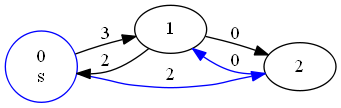
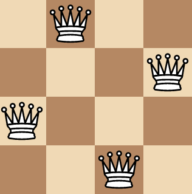
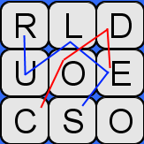

# Sorting & Searching

## DFS & BFS

### Traverse Tree

30 min - Easy

Note: Try to solve this task without using recursion, since this is what you'll be asked to do during an interview.

Given a binary tree of integers t, return its node values in the following format:

The first element should be the value of the tree root;
The next elements should be the values of the nodes at height 1 (i.e. the root children), ordered from the leftmost to the rightmost one;
The elements after that should be the values of the nodes at height 2 (i.e. the children of the nodes at height 1) ordered in the same way;
Etc.

**Example**

For
```
t = {
    "value": 1,
    "left": {
        "value": 2,
        "left": null,
        "right": {
            "value": 3,
            "left": null,
            "right": null
        }
    },
    "right": {
        "value": 4,
        "left": {
            "value": 5,
            "left": null,
            "right": null
        },
        "right": null
    }
}
```
the output should be
solution(t) = [1, 2, 4, 3, 5].

This t looks like this:
```
     1
   /   \
  2     4
   \   /
    3 5
```

<details>
  <summary>Click me to view proposed solution</summary>

**Solution**

``` py
#
# Binary trees are already defined with this interface:
# class Tree(object):
#   def __init__(self, x):
#     self.value = x
#     self.left = None
#     self.right = None
def solution(t):
    if t is None:
        return []
    res=[]
    q=[t]
    while q:
        v=q.pop(0)
        res+=[v.value]
        if v.left:
            q += [v.left]
        if v.right:
            q+=[v.right]
    return res

```
</details>

### Largest Values In Tree Rows

30 min - Easy

You have a binary tree t. Your task is to find the largest value in each row of this tree. In a tree, a row is a set of nodes that have equal depth. For example, a row with depth 0 is a tree root, a row with depth 1 is composed of the root's children, etc.

Return an array in which the first element is the largest value in the row with depth 0, the second element is the largest value in the row with depth 1, the third element is the largest element in the row with depth 2, etc.

**Example**

For
```
t = {
    "value": -1,
    "left": {
        "value": 5,
        "left": null,
        "right": null
    },
    "right": {
        "value": 7,
        "left": null,
        "right": {
            "value": 1,
            "left": null,
            "right": null
        }
    }
}
```
the output should be solution(t) = [-1, 7, 1].

The tree in the example looks like this:
```
    -1
   / \
  5   7
       \
        1
```
In the row with depth 0, there is only one vertex - the root with value -1;
In the row with depth 1, there are two vertices with values 5 and 7, so the largest value here is 7;
In the row with depth 2, there is only one vertex with value 1.

<details>
  <summary>Click me to view proposed solution</summary>

**Solution**
``` py
# Definition for binary tree:
# class Tree(object):
#   def __init__(self, x):
#     self.value = x
#     self.left = None
#     self.right = None
import math
def solution(t):
    if t is None:
        return []
    stack = [t]
    result = []
    while len(stack) > 0:
        result.append(max(tree.value for tree in stack))
        next_row = [tree.left for tree in stack if tree.left] + [tree.right for tree in stack if tree.right]
        stack = next_row
    return result
```
</details>

### Digit Tree Sum

30 min - Medium

We're going to store numbers in a tree. Each node in this tree will store a single digit (from 0 to 9), and each path from root to leaf encodes a non-negative integer.

Given a binary tree t, find the sum of all the numbers encoded in it.

**Example**

For
```
t = {
    "value": 1,
    "left": {
        "value": 0,
        "left": {
            "value": 3,
            "left": null,
            "right": null
        },
        "right": {
            "value": 1,
            "left": null,
            "right": null
        }
    },
    "right": {
        "value": 4,
        "left": null,
        "right": null
    }
}
```
the output should be
solution(t) = 218.
There are 3 numbers encoded in this tree:

Path 1->0->3 encodes 103
Path 1->0->1 encodes 101
Path 1->4 encodes 14
and their sum is 103 + 101 + 14 = 218.
```
t = {
    "value": 0,
    "left": {
        "value": 9,
        "left": null,
        "right": null
    },
    "right": {
        "value": 9,
        "left": {
            "value": 1,
            "left": null,
            "right": null
        },
        "right": {
            "value": 3,
            "left": null,
            "right": null
        }
    }
}
```
the output should be
solution(t) = 193.
Because 09 + 091 + 093 = 193

<details>
  <summary>Click me to view proposed solution</summary>

**Solution**

``` py
# Definition for binary tree:
# class Tree(object):
#   def __init__(self, x):
#     self.value = x
#     self.left = None
#     self.right = None
def solution(t):
    if not t:
        return 0
    
    stack = [(t, 0)]
    sum = 0
    while stack:
        
        cur, v = stack.pop()
        if cur.left or cur.right:
            if cur.left:
                stack.append((cur.left, cur.value + v * 10))
            if cur.right:
                stack.append((cur.right, cur.value + v * 10))
        else:
            sum += cur.value + v * 10
    
    return sum
```
</details>

### Longest Path

Asked by Google - 45 min - Hard

Suppose we represent our file system as a string. For example, the string "user\n\tpictures\n\tdocuments\n\t\tnotes.txt" represents:
```
user
    pictures
    documents
        notes.txt    
```
The directory user contains an empty sub-directory pictures and a sub-directory documents containing a file notes.txt.

The string "user\n\tpictures\n\t\tphoto.png\n\t\tcamera\n\tdocuments\n\t\tlectures\n\t\t\tnotes.txt" represents:
```
user
    pictures
        photo.png
        camera
    documents
        lectures
            notes.txt
```
The directory user contains two sub-directories pictures and documents. pictures contains a file photo.png and an empty second-level sub-directory camera. documents contains a second-level sub-directory lectures containing a file notes.txt.

We want to find the longest (as determined by the number of characters) absolute path to a file within our system. For example, in the second example above, the longest absolute path is "user/documents/lectures/notes.txt", and its length is 33 (not including the double quotes).

Given a string representing the file system in this format, return the length of the longest absolute path to a file in the abstracted file system. If there is not a file in the file system, return 0.

Notes:

Due to system limitations, test cases use form feeds ('\f', ASCII code 12) instead of newline characters.
File names do not contain spaces at the beginning.

**Example**

For fileSystem = "user\f\tpictures\f\tdocuments\f\t\tnotes.txt", the output should be
solution(fileSystem) = 24.

The longest path is "user/documents/notes.txt", and it consists of 24 characters.

<details>
  <summary>Click me to view proposed solution</summary>

**Solution**
``` py
def solution(fileSystem):
    maxlen = 0
    pathlen = {0:0}
    for line in fileSystem.splitlines():
        name = line.lstrip('\t')
        depth = len(line)-len(name)
        if '.' in name:
            maxlen = max(maxlen, pathlen[depth]+len(name))
        else:
            pathlen[depth+1] = pathlen[depth] + len(name)+1
    return maxlen
```
</details>

### Graph Distances

Asked by Adobe and Samsung - 45 min - Hard

You have a strongly connected directed graph that has positive weights in the adjacency matrix g. The graph is represented as a square matrix, where g[i][j] is the weight of the edge (i, j), or -1 if there is no such edge.

Given g and the index of a start vertex s, find the minimal distances between the start vertex s and each of the vertices of the graph.

**Example**

For
```
g = [[-1, 3, 2],
     [2, -1, 0],
     [-1, 0, -1]]
```
and s = 0, the output should be
solution(g, s) = [0, 2, 2].



The distance from the start vertex 0 to itself is 0.
The distance from the start vertex 0 to vertex 1 is 2 + 0 = 2.
The distance from the start vertex 0 to vertex 2 is 2.

<details>
  <summary>Click me to view proposed solution</summary>

**Solution**
``` py
from collections import deque
def solution(g, s):
    dists = [-1 for _ in g]
    dists[s] = 0
    q = deque(graphExpand(g, s))
    while q:
        i, val = q.popleft()
        if dists[i] == -1 or val < dists[i]:
            dists[i] = val
            q.extend(graphExpand(g, i, val))
    return dists

def graphExpand(g, i, dist=0):
    return [(j, dist + v) for j, v in enumerate(g[i]) if v != -1]
```
</details>

## Backtracking

### Climbing Staircase

Asked by Adobe - 30 min - Medium

You need to climb a staircase that has n steps, and you decide to get some extra exercise by jumping up the steps. You can cover at most k steps in a single jump. Return all the possible sequences of jumps that you could take to climb the staircase, sorted.

**Example**

For n = 4 and k = 2, the output should be
```
solution(n, k) =
[[1, 1, 1, 1],
 [1, 1, 2],
 [1, 2, 1],
 [2, 1, 1],
 [2, 2]]
```
There are 4 steps in the staircase, and you can jump up 2 or fewer steps at a time. There are 5 potential sequences in which you jump up the stairs either 2 or 1 at a time.

<details>
  <summary>Click me to view proposed solution</summary>

**Solution**
``` py
def solution(n, k):
    
    return climb(n, k, [])
    
        
        
def climb(n, k, jumps):
    
    if n == 0:
        return [jumps]
    
    out = []
    
    for i in range(1, k+1):
        
        if i > n:
            continue
        
        temp = jumps + [i]
        
        out += climb(n-i, k, temp)
        
    return out
```
</details>

### N Queens

Asked by Amazon and Twitter - 30 min - Hard

In chess, queens can move any number of squares vertically, horizontally, or diagonally. The n-queens puzzle is the problem of placing n queens on an n × n chessboard so that no two queens can attack each other.

Given an integer n, print all possible distinct solutions to the n-queens puzzle. Each solution contains distinct board configurations of the placement of the n queens, where the solutions are arrays that contain permutations of [1, 2, 3, .. n]. The number in the ith position of the results array indicates that the ith column queen is placed in the row with that number. In your solution, the board configurations should be returned in lexicographical order.

**Example**

For n = 1, the output should be
solution(n) = [[1]];

For n = 4, the output should be

  solution(n) = [[2, 4, 1, 3],
                 [3, 1, 4, 2]]
This diagram of the second permutation, [3, 1, 4, 2], will help you visualize its configuration:



The element in the 1st position of the array, 3, indicates that the queen for column 1 is placed in row 3. Since the element in the 2nd position of the array is 1, the queen for column 2 is placed in row 1. The element in the 3rd position of the array is 4, meaning that the queen for column 3 is placed in row 4, and the element in the 4th position of the array is 2, meaning that the queen for column 4 is placed in row 2.

<details>
  <summary>Click me to view proposed solution</summary>

**Solution**
``` py
def solution(n, state=[], col=1):
    if col > n: return [state]
    res = []
    for i in range(1, n+1):
        if invalid(state, i): continue
        for sol in solution(n, state + [i], col+1): res += [sol]
    return res

def invalid(s, r2):
    if not s: return False
    if r2 in s: return True
    c2 = len(s) + 1
    return any(abs(c1-c2) == abs(r1-r2) for c1, r1 in enumerate(s,1))
```
</details>


### Sum Subsets

Asked by Palantir - 30 min - Hard

Given a sorted array of integers arr and an integer num, find all possible unique subsets of arr that add up to num. Both the array of subsets and the subsets themselves should be sorted in lexicographical order.

**Example**

For arr = [1, 2, 3, 4, 5] and num = 5, the output should be
solution(arr, num) = [[1, 4], [2, 3], [5]].

<details>
  <summary>Click me to view proposed solution</summary>

**Solution**

``` py

def solution(arr, num):
    result = set()
    
    def addSumSubsets(arr_i, target, subset):
        if target == 0:
            result.add(subset)
        elif arr_i >= len(arr) or target < 0:
            return
        else:
            n = arr[arr_i]
            addSumSubsets(arr_i+1, target-n, subset+(n,))
            addSumSubsets(arr_i+1, target, subset)
    
    addSumSubsets(0, num, ())
    return sorted(list(result))
```
</details>

### Word Boggle

35 min - Medium

Boggle is a popular word game in which players attempt to find words in sequences of adjacent letters on a rectangular board.

Given a two-dimensional array board that represents the character cells of the Boggle board and an array of unique strings words, find all the possible words from words that can be formed on the board.

Note that in Boggle when you're finding a word, you can move from a cell to any of its 8 neighbors, but you can't use the same cell twice in one word.

**Example**

For
```
board = [
    ['R', 'L', 'D'],
    ['U', 'O', 'E'],
    ['C', 'S', 'O']
]
```
and words = ["CODE", "SOLO", "RULES", "COOL"], the output should be
solution(board, words) = ["CODE", "RULES"]



<details>
  <summary>Click me to view proposed solution</summary>

**Solution**

``` py
def solution(board, words):
    r = []
    for word in words:
        if canBoggle(board,word):
            r.append(word)
    return sorted(r)

def canBoggle(board, word, used = []):
    if len(word) == 0:
        return True
    for i in range(len(board)):
        for j in range(len(board[0])):
            if (i,j) not in used and board[i][j] == word[0]:
                if len(used)==0 or (abs(used[-1][0] - i)<=1 and abs(used[-1][1] - j)<= 1):
                    if canBoggle(board,word[1:],used + [(i,j)]):
                        return True
    return False    
```
</details>

### Combination Sum

Asked by Amazon, Adobe and Microsoft - 40 min - Hard

Given an array of integers a and an integer sum, find all of the unique combinations in a that add up to sum.
The same number from a can be used an unlimited number of times in a combination.
Elements in a combination (a1 a2 … ak) must be sorted in non-descending order, while the combinations themselves must be sorted in ascending order.
If there are no possible combinations that add up to sum, the output should be the string "Empty".

**Example**

For a = [2, 3, 5, 9] and sum = 9, the output should be
solution(a, sum) = "(2 2 2 3)(2 2 5)(3 3 3)(9)".

<details>
  <summary>Click me to view proposed solution</summary>

**Solution**

``` py
def solution(a, s):
    arr = sorted(set(a))
    ans = list(comb_recur([], arr, s))
    ans.sort()
    if len(ans) == 0:
        return 'Empty'
    else:
        return '({})'.format(')('.join(' '.join(map(str, row)) for row in ans))

def comb_recur(pref, arr, s):
    for i, val in enumerate(arr):
        if val == s:
            yield pref + [val]
        elif val < s:
            yield from comb_recur(pref + [val], arr[i:], s-val)
        elif val > s:
            break
```
</details>