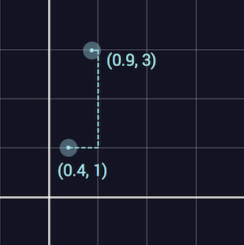
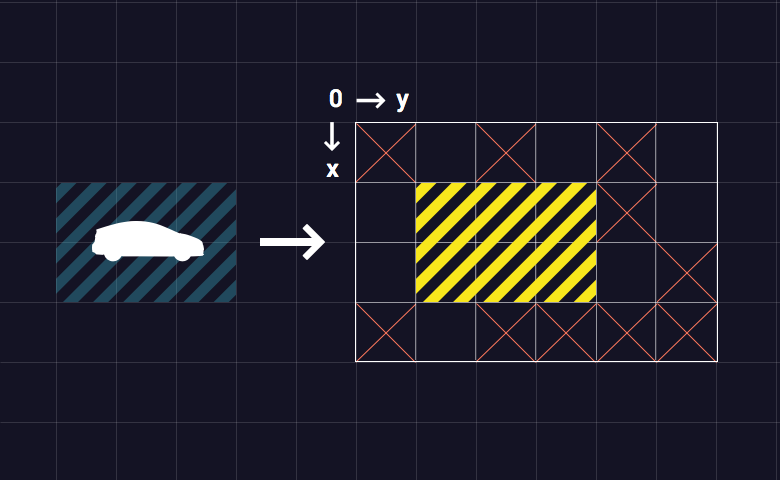
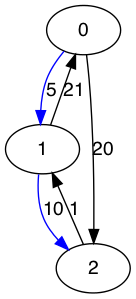
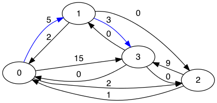
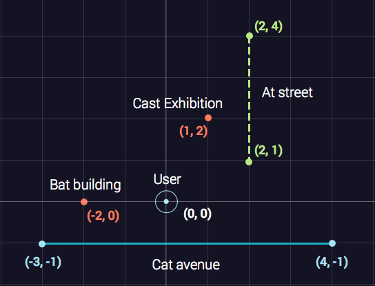

## Fare Estimator

5 min - Easy

Uber is building a Fare Estimator that can tell you how much your ride will cost before you request it. It works by passing approximated ride distance and ride time through this formula:

(Cost per minute) * (ride time) + (Cost per mile) * (ride distance)

where Cost per minute and Cost per mile depend on the car type.

You are one of the engineers building the Fare Estimator, so knowing cost per minute and cost per mile for each car type, as well as ride distance and ride time, return the fare estimates for all car types.

**Example**

For
ride_time = 30,

ride_distance = 7,

cost_per_minute = [0.2, 0.35, 0.4, 0.45], and

cost_per_mile = [1.1, 1.8, 2.3, 3.5], the output should be

solution(ride_time, ride_distance, cost_per_minute, cost_per_mile) = [13.7, 23.1, 28.1, 38].

Since:

```
30 * 0.2 + 7 * 1.1 = 6 + 7.7 = 13.7
30 * 0.35 + 7 * 1.8 = 10.5 + 12.6 = 23.1
30 * 0.4 + 7 * 2.3 = 12 + 16.1 = 28.1
30 * 0.45 + 7 * 3.5 = 13.5 + 24.5 = 38
```
<details>
  <summary>Click me for proposed solution</summary>
  
**Solution**
``` py
def solution(ride_time, ride_distance, cost_per_minute, cost_per_mile):
    return [ride_time*i+ride_distance*j for (i,j) in zip(cost_per_minute,cost_per_mile)]
```
</details>
## Perfect City

30 min - Medium

Consider a city where the streets are perfectly laid out to form an infinite square grid. In this city finding the shortest path between two given points (an origin and a destination) is much easier than in other more complex cities. As a new Uber developer, you are tasked to create an algorithm that does this calculation.

Given user's departure and destination coordinates, each of them located on some street, find the length of the shortest route between them assuming that cars can only move along the streets. Each street can be represented as a straight line defined by the x = n or y = n formula, where n is an integer.

**Example**

For departure = [0.4, 1] and destination = [0.9, 3], the output should be
solution(departure, destination) = 2.7.

0.6 + 2 + 0.1 = 2.7, which is the answer.


<details>
  <summary>Click me for proposed solution</summary>

**Solution**

``` py
def solution(departure, destination):
    if int(departure[1])==departure[1]:
        x = math.ceil(min(departure[0],destination[0]))
        y = math.floor(max(departure[0],destination[0]))
        return abs(departure[1]-destination[1])+min(abs(x-departure[0])+abs(x-destination[0]),abs(y-departure[0])+abs(y-destination[0]))
    else:
        x = math.ceil(min(departure[1],destination[1]))
        y = math.floor(max(departure[1],destination[1]))
        return abs(departure[0]-destination[0])+min(abs(x-departure[1])+abs(x-destination[1]),abs(y-departure[1])+abs(y-destination[1]))
```
</details>
## Parking Spot

30 min - Medium

This time you are an Uber driver and you are trying your best to park your car in a parking lot.

Your car has length carDimensions[0] and width carDimensions[1]. You have already picked your lucky spot (rectangle of the same size as the car with upper left corner at (luckySpot[0], luckySpot[1])) and bottom right corner at (luckySpot[2], luckySpot[3]) and you need to find out if it's possible to park there or not.

It is possible to park your car at a given spot if and only if you can drive through the parking lot without any turns to your lucky spot (for safety reasons, the car can only move in two directions inside the parking lot - forwards or backwards along the long side of the car) starting from some side of the lot (all four sides are valid options).

Naturally, you can't park your car if the lucky spot is already occupied. The car can't drive through or park at any of the occupied spots.

**Example**

For carDimensions = [3, 2],
```
parkingLot = [[1, 0, 1, 0, 1, 0],
              [0, 0, 0, 0, 1, 0],
              [0, 0, 0, 0, 0, 1],
              [1, 0, 1, 1, 1, 1]]
```
and
luckySpot = [1, 1, 2, 3], the output should be

solution(carDimensions, parkingLot, luckySpot) = true




For carDimensions = [3, 2],
```
parkingLot = [[1, 0, 1, 0, 1, 0],
              [1, 0, 0, 0, 1, 0],
              [0, 0, 0, 0, 0, 1],
              [1, 0, 0, 0, 1, 1]]
```
and
luckySpot = [1, 1, 2, 3], the output should be

solution(carDimensions, parkingLot, luckySpot) = false;

For carDimensions = [4, 1],
```
parkingLot = [[1, 0, 1, 0, 1, 0],
              [1, 0, 0, 0, 1, 0],
              [0, 0, 0, 0, 0, 1],
              [1, 0, 0, 0, 1, 1]]
```
and
luckySpot = [0, 3, 3, 3], the output should be

solution(carDimensions, parkingLot, luckySpot) = true.

<details>
  <summary>Click me for proposed solution</summary>
**Solution**

``` py
def solution(dim, lot, spot):
    if not is_empty(lot,spot[:2],spot[2:]):
        return False
        
    if spot[3] - spot[1] > spot[2] - spot[0]:
        return is_empty(lot, (spot[0],0),(spot[2],spot[1])) or is_empty(lot,(spot[0],spot[3]),(spot[2], len(lot[0]) -1))
    else:
        return is_empty(lot, (0, spot[1]),(spot[0],spot[3])) or is_empty(lot, (spot[2],spot[1]),( len(lot) -1, spot[3]))
    
        
def is_empty(l,p1,p2):
    for i in range(p1[0], p2[0]+1):
        for j in range(p1[1],p2[1]+1):
            if l[i][j] == 1:
                return False
    return True
```
</details>
## Fancy Ride

5 min - Easy

Being a new Uber user, you have $20 off your first ride. You want to make the most out of it and drive in the fanciest car you can afford, without spending any out-of-pocket money. There are 5 options, from the least to the most expensive: "UberX", "UberXL", "UberPlus", "UberBlack" and "UberSUV".

You know the length l of your ride in miles and how much one mile costs for each car. Find the best car you can afford.

**Example**

For l = 30 and fares = [0.3, 0.5, 0.7, 1, 1.3], the output should be
solution(l, fares) = "UberXL".

The cost for the ride in this car would be $15, which you can afford, but "UberPlus" would cost $21, which is too much for you.
<details>
  <summary>Click me for proposed solution</summary>
**Solution**

``` py
def solution(l, fares):
    opt=["UberX", "UberXL", "UberPlus", "UberBlack", "UberSUV"]
    for ride,cost in enumerate(fares):
        if cost*l <= 20:
            ans = opt[ride]
    return ans 
```
</details>

## Night Route

15 min - Medium

Consider a big city located on n islands. There are bridges connecting the islands, but they all have only one-way traffic. To make matters worse, most of the bridges are closed at night, so there is at most one bridge with traffic going from any island A to any other island B.

There is a programmer who turns a penny by working nights as an Uber driver. One night his phone dies right after he picks up a rider going from island 0 to island (n - 1). He has the map of the city bridges in his laptop though (stored as a matrix of distances), so he decides to implement an algorithm that calculates the shortest path between those two islands and evaluate the cost based on the distance of the path. Assume that each mile of the trip is 1$.

**Example**

For
```
city = [[-1, 5, 20],
        [21, -1, 10],
        [-1, 1, -1]]
```
the output should be solution(city) = 15.

city[i][j] equals the distance between the ith and the jth islands in miles, or -1 if there is no bridge by which one can move from island i to island j.

solution(city) should be 15, since the shortest distance from the 0th to the 2nd island is 15. The distance from the 0th to the 1st is city[0][1] = 5, and from the 1st to the 2nd is city[1][2] = 10.



For
```
city = [[-1, 5, 2, 15],
        [2, -1, 0, 3],
        [1, -1, -1, 9],
        [0, 0, 0, -1]]
```
the output should be solution(city) = 8.

The shortest path is 0 -> 1 -> 3 which costs 5 + 3 = 8.



<details>
  <summary>Click me for proposed solution</summary>

**Solution**

``` py
def solution(city):
    return shortest(city,0,set())
    
def shortest(city,cur,visited):
    # Base case
    if cur == len(city) - 1: #arrive to target
        return 0
    best = None
    #print(f'current :{cur}')
    for nxt, d in enumerate(city[cur]):
        if nxt not in visited and d != -1:
            #print(nxt)
            visited.add(nxt)
            path_nxt_n = shortest(city, nxt, visited)
            visited.remove(nxt)
            if path_nxt_n is not None:
                path_cur_n = path_nxt_n + d
                if best is None or path_cur_n < best:
                    best = path_cur_n
    return best
```
</details>

## Closest Location

35 min - Medium

The Uber app has an integrated map that simplifies selecting a destination. To make it even better, Uber guesses the location even if there is a typo in the inputted address.

Consider a map with streets and buildings located on the Cartesian plane with integer coordinates. The distances on this map are calculated as follows:

The distance between two points is the length of the segment connecting them.
The distance between a segment and a point is defined as the shortest distance between the given point and any point on the segment.
A user has started to type in their destination, and it's your task to guess what they are looking for.

Let the rider's position be at [0, 0]. Given the positions of some objects around them, and the address they have already typed in, find out what their destination is. To do this, find the object closest to the rider with a name that has a prefix which is similar to the text that's already entered. Since it's possible that there is a typo in the input, let similar mean one of the following:

the typed in address is identical to the prefix of the object's address;
they differ only by one symbol;
user's input has one extra symbol;
user's input has one missing symbol.
Note that the comparison should be case-insensitive.

For example, if the user typed in "Cat", the following can be suggested: "Cat street", "Bat building", "_At avenue" (the first letter is deleted), and "Cast exhibition".

**Example**

For address = "Cat", objects = [[-2, 0], [1, 2], [2, 1, 2, 4], [-3, -1, 4, -1]], and
names = ["Bat building", "Cast exhibition", "At street", "Cat avenue"], the output should be
solution(address, objects, names) = "Cat avenue".

Since all the names are similar to what the user has typed, and the distances to them are respectively 2, √5, √5 and 1 (see the picture below for better understanding).


<details>
  <summary>Click me for proposed solution</summary>
**Solution**
  
``` py
def solution(address, objects, names):
    ind = set()
    for i,name in enumerate(names):
        if chkTypos(address, name):
            ind.add(i)
            
    print(ind)
    min_dist=None
    min_ind=None
    for i in ind:
        obj=objects[i]
        if len(obj)==2: #Obj is a point
            dist=dist_sq((0,0),obj)
        else: #Obj is a segment
            dist= dist_seg((0,0),obj)
        if min_dist is None or dist < min_dist:
            min_dist = dist
            min_ind=i  
    return names[min_ind]

def dist_seg(p, seg):
    ## Vertical Segment
    if seg[0] == seg[2] and p[1] >= min(seg[1], seg[3]) and p[1] <= max(seg[1],seg[3]):
        return (p[0] - seg[0])**2
    ## Horizontal Segment
    if seg[1] == seg[3] and p[0] >= min(seg[0], seg[2]) and p[0] <= max(seg[0],seg[2]):
        return (p[1] - seg[1])**2
    return min(dist_sq(p,seg[:2]),dist_sq(p,seg[2:]))
    ##When point is outside the segment

def dist_sq(p1,p2):
    return (p1[0]-p2[0])**2 + (p1[1]-p2[1])**2

def chkTypos(word, location):
    word = word.lower()
    location = location.lower()
    if word == location[:len(word)]: #use location prefix
        return True
    if chkDiff(word, location):
        return True
    if chkMiss(word, location[:len(word)+1]):
        return True
    if chkMiss(location[:len(word)-1],word):
        return True
    return False

def chkDiff(word, location):
    if len(word) > len(location):
        return False
    diff = False
    for i in range(len(word)):
        if word[i] != location[i]:
            if diff:
                return False
            diff = True
    return True

def chkMiss(w1,w2):
    if (len(w1)+1) != len(w2):
        return False
    missing = False
    i, j = (0,0)
    while i < len(w1) and j < len(w2):
        if w1[i] != w2[j]:
            if missing:
                return False
            missing = True
            j += 1
        else:
            i += 1
            j += 1
    return True
```
</details>

## Uber First Tech Interview

During a day, there are millions of transactions happening between banks. Because there are so many transactions, those are sorted only at the end of each day, when the balances between each bank are calculated. This is called “settlement”. The process of calculating the end of day balances between banks, and moving the money from one to another. Because this process is so complex, banks work with “clearing houses”. Those are third party financial institutions to which banks send all their transactions and that processes the “settlement” for them.

We want to build the software for a clearing house.

First step is to simply write software to sort a list of transactions with a payer, payee and amount and calculate all balances between each pair of banks.

**Example**
```
transactions = [ {"payee": "BoA", "amount": 132, "payer": "Chase"}, {"payee": "BoA", "amount": 827, "payer": "Chase"}, {"payee": "Wells Fargo", "amount": 751, "payer": "BoA"}, {"payee": "BoA", "amount": 585, "payer": "Chase"}, {"payee": "Chase", "amount": 877, "payer": "Wells Fargo"}, {"payee": "Wells Fargo", "amount": 157, "payer": "Chase"}, {"payee": "Wells Fargo", "amount": 904, "payer": "Chase"}, {"payee": "Chase", "amount": 548, "payer": "Wells Fargo"}, {"payee": "Chase", "amount": 976, "payer": "BoA"}, {"payee": "BoA", "amount": 872, "payer": "Wells Fargo"}, {"payee": "Wells Fargo", "amount": 571, "payer": "Chase"} ]

result: {('BoA', 'Wells Fargo'): -121.0, ('Chase', 'Wells Fargo'): 207.0, ('BoA', 'Chase'): -568.0}
```
<details>
  <summary>Click me for proposed solution</summary>
**Solution**
  
``` py
from collections import defaultdict


transactions = [
  {"payee": "BoA", "amount": 132, "payer": "Chase"},
  {"payee": "BoA", "amount": 827, "payer": "Chase"},
  {"payee": "Wells Fargo", "amount": 751, "payer": "BoA"},
  {"payee": "BoA", "amount": 585, "payer": "Chase"},
  {"payee": "Chase", "amount": 877, "payer": "Wells Fargo"},
  {"payee": "Wells Fargo", "amount": 157, "payer": "Chase"},
  {"payee": "Wells Fargo", "amount": 904, "payer": "Chase"},
  {"payee": "Chase", "amount": 548, "payer": "Wells Fargo"},
  {"payee": "Chase", "amount": 976, "payer": "BoA"},
  {"payee": "BoA", "amount": 872, "payer": "Wells Fargo"},
  {"payee": "Wells Fargo", "amount": 571, "payer": "Chase"}
]

def settlement(transactions):
    res=defaultdict()
    for val in transactions:
        if (val['payee'], val['payer']) in res:  #subtract the transaction value
            res[(val['payee'],val['payer'])]-=val['amount']
        elif (val['payer'],val['payee']) in res: #add the transaction value
            res[(val['payer'],val['payee'])]+=val['amount']
        else:
            res[(val['payee'],val['payer'])]=float(-val['amount'])
            
    return res
    
print(settlement(transactions))

```

```
defaultdict(None, {('BoA', 'Chase'): -568.0, ('Wells Fargo', 'BoA'): 121.0, ('Chase', 'Wells Fargo'): 207.0})
```

</details>