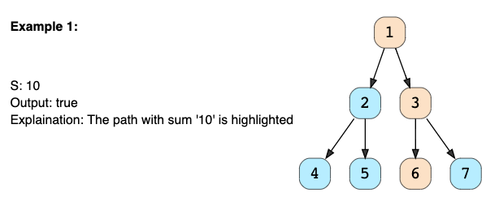

Not solving coding problems but practicing to map problems onto problems that you have already solved.

## 1 - If input is sorted
If the given input is sorted (array, list, or matrix), we will use a [variation of Binary Search](pyCodPatterns.md#modified-binary-search) or a [Two Pointers](pyCodPatterns.md#two-pointers) strategy.

**Sample Problem for Binary Search**

Bitonic array maximum Problem Statement: Find the maximum value in a given Bitonic array. An array is considered bitonic if it is monotonically increasing and then monotonically decreasing. Monotonically increasing or decreasing means that for any index i in the array, arr[i] != arr[i+1].

Example: Input: [1, 3, 8, 12, 4, 2], Output: 12

**Solution**

A bitonic array is a sorted array; the only difference is that its first part is sorted in ascending order, and the second part is sorted in descending order. We can use a variation of Binary Search to solve this problem. Remember that in Binary Search, we have start, end, and middle indices, and in each step, we reduce our search space by moving start or end. Since no two consecutive numbers are the same (as the array is monotonically increasing or decreasing), whenever we calculate the middle index for Binary Search, we can compare the numbers pointed out by the index middle and middle+1 to find if we are in the ascending or the descending part. So:

1. If arr[middle] > arr[middle + 1], we are in the second (descending) part of the bitonic array. Therefore, our required number could either be pointed out by middle or will be before middle. This means we will do end = middle.

2. If arr[middle] <= arr[middle + 1], we are in the first (ascending) part of the bitonic array. Therefore, the required number will be after middle. This means we do start = middle + 1.

We can break when start == end. Due to the above two points, both start and end will point at the maximum number of the Bitonic array.

``` java
class MaxInBitonicArray {

  public static int findMax(int[] arr) {
    int start = 0, end = arr.length - 1;
    while (start < end) {
      int mid = start + (end - start) / 2;
      if (arr[mid] > arr[mid + 1]) {
        end = mid;
      } else {
        start = mid + 1;
      }
    }

    // at the end of the while loop, 'start == end'
    return arr[start];
  }

  public static void main(String[] args) {
    System.out.println(MaxInBitonicArray.findMax(new int[] { 1, 3, 8, 12, 4, 2 }));
    System.out.println(MaxInBitonicArray.findMax(new int[] { 3, 8, 3, 1 }));
    System.out.println(MaxInBitonicArray.findMax(new int[] { 1, 3, 8, 12 }));
    System.out.println(MaxInBitonicArray.findMax(new int[] { 10, 9, 8 }));
  }
}
```

**Sample Problem for Two Pointers**

Pair with the target sum 

Problem Statement: 

Given an array of sorted numbers and a target sum, find a pair in the array whose sum is equal to the given target.

Write a function to return the indices of the two numbers (i.e., the pair) such that they add up to the given target.

Example: 

Input: [1, 2, 3, 4, 6], target = 6, Output: [1, 3] (The numbers at index 1 and 3 add up to 6: 2+4=6)

**Solution**

Since the given array is sorted, a brute-force solution could be to iterate through the array, taking one number at a time and searching for the second number through Binary Search. The time complexity of this algorithm will be O(N*logN). Can we do better than this?

We can follow the Two Pointers approach. We will start with one pointer pointing to the beginning of the array and another pointing at the end. At every step, we will see if the numbers pointed by the two pointers add up to the target sum. If they do, we’ve found our pair. Otherwise, we’ll do one of two things:

If the sum of the two numbers pointed by the two pointers is greater than the target sum, we need a pair with a smaller sum. So, to try more pairs, we can decrement the end-pointer.
If the sum of the two numbers pointed by the two pointers is smaller than the target sum, this means that we need a pair with a larger sum. So, to try more pairs, we can increment the start-pointer.
Here is the visual representation of this algorithm for the example mentioned above:
``` java
class PairWithTargetSum {

  public static int[] search(int[] arr, int targetSum) {
    int left = 0, right = arr.length - 1;
    while (left < right) {
      // comparing the sum of two numbers to the 'targetSum' can cause integer overflow
      // so, we will try to find a target difference instead
      int targetDiff = targetSum - arr[left];
      if (targetDiff == arr[right])
        return new int[] { left, right }; // found the pair

      if (targetDiff > arr[right])
        left++; // we need a pair with a bigger sum
      else
        right--; // we need a pair with a smaller sum
    }
    return new int[] { -1, -1 };
  }

  public static void main(String[] args) {
    int[] result = PairWithTargetSum.search(new int[] { 1, 2, 3, 4, 6 }, 6);
    System.out.println("Pair with target sum: [" + result[0] + ", " + result[1] + "]");
    result = PairWithTargetSum.search(new int[] { 2, 5, 9, 11 }, 11);
    System.out.println("Pair with target sum: [" + result[0] + ", " + result[1] + "]");
  }
}
```

## 2 - If need top/max/min/closest k ele

If we’re dealing with [top/maximum/minimum/closest k elements](pyCodPatterns.md#top-k-elements) among n elements, we will use a Heap.

**Sample Problem**

K closest points to the origin Problem Statement: Given an array of points in a 2D plane, find K closest points to the origin.

Example: 

Input: points = [[1,2],[1,3]], K = 1, Output: [[1,2]]

**Solution**

The Euclidean distance of a point P(x,y) from the origin can be calculated through the following formula:

We can use a Max Heap to find K points closest to the origin. We can start by pushing K points in the heap. While iterating through the remaining points, if a point (say P) is closer to the origin than the top point of the max-heap, we will remove that top point from the heap and add P to always keep the closest points in the heap.

``` java
import java.util.*;

class Point {
  int x;
  int y;

  public Point(int x, int y) {
    this.x = x;
    this.y = y;
  }

  public int distFromOrigin() {
    // ignoring sqrt
    return (x * x) + (y * y);
  }
}

class KClosestPointsToOrigin {

  public static List<Point> findClosestPoints(Point[] points, int k) {
    PriorityQueue<Point> maxHeap = new PriorityQueue<>(
              (p1, p2) -> p2.distFromOrigin() - p1.distFromOrigin());
    // put first 'k' points in the max heap
    for (int i = 0; i < k; i++)
      maxHeap.add(points[i]);

    // go through the remaining points of the input array, if a point is closer to 
    // the origin than the top point of the max-heap, remove the top point from 
    // heap and add the point from the input array
    for (int i = k; i < points.length; i++) {
      if (points[i].distFromOrigin() < maxHeap.peek().distFromOrigin()) {
        maxHeap.poll();
        maxHeap.add(points[i]);
      }
    }

    // the heap has 'k' points closest to the origin, return them in a list
    return new ArrayList<>(maxHeap);
  }

  public static void main(String[] args) {
    Point[] points = new Point[] { new Point(1, 3), new Point(3, 4), new Point(2, -1) };
    List<Point> result = KClosestPointsToOrigin.findClosestPoints(points, 2);
    System.out.print("Here are the k points closest the origin: ");
    for (Point p : result)
      System.out.print("[" + p.x + " , " + p.y + "] ");
  }
}
```

## 3 - If need all combinations (or perm)

If we need to try all combinations (or permutations) of the input, we can either use recursive Backtracking or iterative [Breadth-First Search](pyCodPatterns.md#breadth-first-search).

**Sample Problem**

Subsets 

Problem Statement: 

Given a set with distinct elements, find all of its distinct subsets.

Example: Input: [1, 5, 3] Output: [], [1], [5], [3], [1,5], [1,3], [5,3], [1,5,3]

**Solution**

We can use the Breadth-First Search (BFS) approach to generate all subsets of the given set. We can start with an empty set, iterate through all numbers one-by-one, and add them to existing sets to create new subsets.

Let’s take the aforementioned example to go through each step of our algorithm:

Given set: [1, 5, 3]

Start with an empty set: [[]] Add the first number (1) to all the existing subsets to create new subsets: [[], [1]]; Add the second number (5) to all the existing subsets: [[], [1], [5], [1,5]]; Add the third number (3) to all the existing subsets: [[], [1], [5], [1,5], [3], [1,3], [5,3], [1,5,3]]. Here is the visual representation of the above steps:


``` java
import java.util.*;

class Subsets {

  public static List<List<Integer>> findSubsets(int[] nums) {
    List<List<Integer>> subsets = new ArrayList<>();
    // start by adding the empty subset
    subsets.add(new ArrayList<>());
    for (int currentNumber : nums) {
      // we will take all existing subsets and insert the current number in them to
      // create new subsets
      int n = subsets.size();
      for (int i = 0; i < n; i++) {
        // create a new subset from the existing subset and 
        // insert the current element to it
        List<Integer> set = new ArrayList<>(subsets.get(i));
        set.add(currentNumber);
        subsets.add(set);
      }
    }
    return subsets;
  }

  public static void main(String[] args) {
    List<List<Integer>> result = Subsets.findSubsets(new int[] { 1, 3 });
    System.out.println("Here is the list of subsets: " + result);

    result = Subsets.findSubsets(new int[] { 1, 5, 3 });
    System.out.println("Here is the list of subsets: " + result);
  }
}
```

## 4 - If Trees or Graphs
Most of the questions related to Trees or Graphs can be solved through [BFS](pyCodPatterns.md#breadth-first-search) or [DFS](pyCodPatterns.md#depth-first-search)

**Sample Problem**

Binary Tree Path Sum

Problem Statement: 

Given a binary tree and a number S, find if the tree has a path from root-to-leaf such that the sum of all the node values of that path equals S.



**Solution**

As we are trying to search for a root-to-leaf path, we can use the Depth First Search (DFS) technique to solve this problem.

To recursively traverse a binary tree in a DFS fashion, we can start from the root and, at every step, make two recursive calls, one for the left and one for the right child.

Here are the steps for our Binary Tree Path Sum problem:

1. Start DFS with the root of the tree.
2. If the current node is not a leaf node, do two things: a) Subtract the value of the current node from the given number to get a new sum => S = S - node.value, b) Make two recursive calls for both the children of the current node with the new number calculated in the previous step.
3. At every step, see if the current node being visited is a leaf node and if its value is equal to the given number S. If both are true, we have found the required root-to-leaf path, therefore return true.
4. If the current node is a leaf, but its value is not equal to the given number S, return false.

``` java
class TreeNode {
  int val;
  TreeNode left;
  TreeNode right;

  TreeNode(int x) {
    val = x;
  }
};

class TreePathSum {
  public static boolean hasPath(TreeNode root, int sum) {
    if (root == null)
      return false;

    // if current node is a leaf and its value is equal to the sum, we've found a path
    if (root.val == sum && root.left == null && root.right == null)
      return true;

    // recursively call to traverse the left and right sub-tree
    // return true if any of the two recursive call return true
    return hasPath(root.left, sum - root.val) || hasPath(root.right, sum - root.val);
  }

  public static void main(String[] args) {
    TreeNode root = new TreeNode(12);
    root.left = new TreeNode(7);
    root.right = new TreeNode(1);
    root.left.left = new TreeNode(9);
    root.right.left = new TreeNode(10);
    root.right.right = new TreeNode(5);
    System.out.println("Tree has path: " + TreePathSum.hasPath(root, 23));
    System.out.println("Tree has path: " + TreePathSum.hasPath(root, 16));
  }
}
```

## 5 - Recursive to Iterative
Every recursive solution can be converted to an iterative solution using a Stack

## 6 - Brute force with O(n2) and O(1) space
If a problem where a brute force solution exists in O(n2) time and O(1) space, there must exist other 2 solutions:

Using Map or a Set for O(n) time and O(n)space
Using sorting for O(nlogn) time and O(1) space

## 7 - If optimization
If the problem is asking for optimization (e.g. maximization or minimization ), we will use [Dynamic Programming](../Algo/pyDynamic.md) to solve it.

## 8 - Common substring among a set
If we need to find common substring among a set of strings, we will be using a HashMap or a Trie.

## 9 - Search in strings
If we need to search among a bunch of strings, Trie will be the best DS

## 10 - If a LinkedList
If the problem involves a LinkedList and we can´t use extra space, then use [Fast&Slow pointer](pyCodPatterns.md#fast-and-slow-pointers) approach