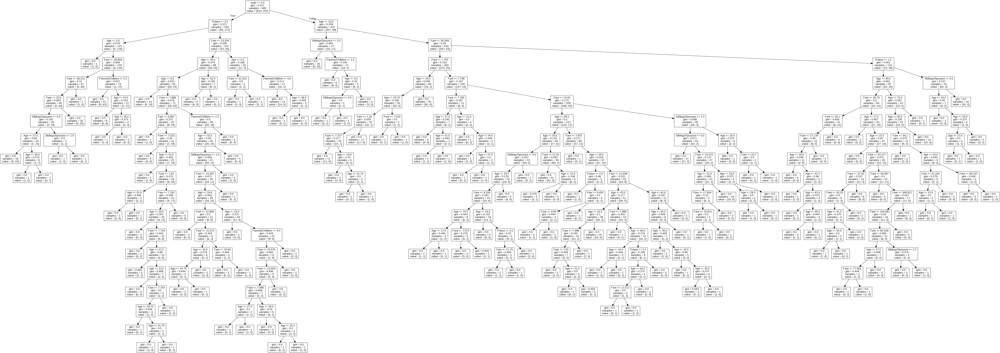

In Logistic Regression, we look at the data graphically and draw a line to separate the data. The model is defined by the coefficients that define the line. These coefficients are called parameters. Since the model is defined by these parameters, Logistic Regression is a parametric machine learning algorithm.

Decision Trees, are an example of a nonparametric machine learning algorithm. Decision Trees won’t be defined by a list of parameters.

Every machine learning algorithm is either parametric or nonparametric. Decision Trees are often favored if you have a non-technical audience since they can easily interpret the model.

The Logistic Regression model performs better, though we may still want to use a Decision Tree for its interpretability.

The default impurity criterion in scikit-learn’s Decision Tree algorithm is the Gini Impurity (2p(1-p)). However, they’ve also implemented entropy and you can choose which one you’d like to use when you create the DecisionTreeClassifier object.

``` py
dt = DecisionTreeClassifer(criterion='entropy')
```

``` py
from sklearn.tree import DecisionTreeClassifier
from sklearn.model_selection import train_test_split
from sklearn.tree import export_graphviz
import pandas as pd
import graphviz
from IPython.display import Image


df = pd.read_csv('titanic.csv')
df['male'] = df['Sex'] == 'male'
X = df[['Pclass', 'male', 'Age', 'Siblings/Spouses', 'Parents/Children', 'Fare']].values
y = df['Survived'].values
model = DecisionTreeClassifier()
X_train, X_test, y_train, y_test = train_test_split(X, y, random_state=22)
model.fit(X_train, y_train)
print(model.predict([[3,True,22,1,0,7.25]]))

feature_names = ['Pclass', 'male', 'Age', 'Siblings/Spouses', 'Parents/Children', 'Fare'  ]
dot_file = export_graphviz(model, feature_names=feature_names)
graph = graphviz.Source(dot_file) #graphviz module to convert it to a png image format
graph.render(filename='tree', format='png', cleanup=True)
```
```
[0]
tree.png
```


Recall that overfitting is when we do a good job of building a model for the training set, but it doesn’t perform well on the test set. Decision Trees are incredibly prone to overfitting. Since they can keep having additional nodes in the tree that split on features, the model can really dig deep into the specifics of the training set. Depending on the data, this might result in a model that doesn’t capture the true nature of the data and doesn’t generalize.

If you let a Decision Tree keep building, it may create a tree that’s overfit and doesn’t capture the essence of the data. 

In order to solve these issues, we do what’s called **pruning** the tree. This means we make the tree smaller with the goal of reducing overfitting.

There are two types of pruning: pre-pruning & post-pruning. In pre-pruning, we have rules of when to stop building the tree, so we stop building before the tree is too big. In post-pruning we build the whole tree and then we review the tree and decide which leaves to remove to make the tree smaller.

## Pre-pruning techniques

* *Max depth*: Only grow the tree up to a certain depth, or height of the tree. If the max depth is 3, there will be at most 3 splits for each datapoint.
* *Leaf size*: Don’t split a node if the number of samples at that node is under a threshold
* *Number of leaf nodes*: Limit the total number of leaf nodes allowed in the tree

Pruning is a balance. For example, if you set the max depth too small, you won’t have much of a tree and you won’t have any predictive power. This is called underfitting. Similarly if the leaf size is too large, or the number of leaf nodes too small, you’ll have an underfit model.

``` py
from sklearn.tree import DecisionTreeClassifier
from sklearn.model_selection import train_test_split
import pandas as pd


df = pd.read_csv('https://sololearn.com/uploads/files/titanic.csv')
df['male'] = df['Sex'] == 'male'
X = df[['Pclass', 'male', 'Age', 'Siblings/Spouses', 'Parents/Children', 'Fare']].values
y = df['Survived'].values
'''
Decision Tree with the following properties:
• max depth of 3
• minimum samples per leaf of 2
• maximum number of leaf nodes of 10
'''
dt = DecisionTreeClassifier(max_depth=3, min_samples_leaf=2, max_leaf_nodes=10)
X_train, X_test, y_train, y_test = train_test_split(X, y, random_state=22)
dt.fit(X_train, y_train)
print(dt.predict([[3,True,22,1,0,7.25]]))

```
```
[0]
```
We’re not going to be able to intuit best values for the pre-pruning parameters. In order to decide on which to use, we use cross validation and compare metrics.

GridSearchCV has four parameters that we’ll use:

1. The model (in this case a DecisionTreeClassifier)
2. Param grid: a dictionary of the parameters names and all the possible values
3. What metric to use (default is accuracy)
4. How many folds for k-fold cross validation

``` py
from sklearn.model_selection import GridSearchCV
from sklearn.tree import DecisionTreeClassifier
from sklearn.model_selection import train_test_split
import pandas as pd

df = pd.read_csv('https://sololearn.com/uploads/files/titanic.csv')
df['male'] = df['Sex'] == 'male'
X = df[['Pclass', 'male', 'Age', 'Siblings/Spouses', 'Parents/Children', 'Fare']].values
y = df['Survived'].values
#Since we have 3 possible values for max_depth, 2 for min_samples_leaf and 
#4 for max_leaf_nodes, we have 3 * 2 * 4 = 24 different combinations
param_grid = {
    'max_depth': [5, 15, 25],
    'min_samples_leaf': [1, 3],
    'max_leaf_nodes': [10, 20, 35, 50]}

dt = DecisionTreeClassifier()
gs = GridSearchCV(dt, param_grid, scoring='f1', cv=5)

gs.fit(X, y)

print("Best params: ",gs.best_params_)
print("Best score: ",gs.best_score_)
```
```
Best params:  {'max_depth': 25, 'max_leaf_nodes': 35, 'min_samples_leaf': 1}
Best score:  0.7745375458302277
```

## Computation

When talking about how much computation is required for a machine learning algorithm, we separate it into two questions: how much computation is required to build the model and how much is required to predict.

A decision tree is very computationally expensive to build. This is because at every node we are trying every single feature and threshold as a possible split. We have to calculate the information gain of each of these possible splits each time. This is computationally very expensive.

Predicting with a decision tree on the other hand, is computational very inexpensive. You just need to ask a series of yes/no questions about the datapoint to get to the prediction. Generally we care much more about the computation time for prediction than training. Predictions often need to happen in real time while a user is waiting for a result.

## Performance

Decision Trees can perform decently well depending on the data, though as we have discussed, they are prone to overfitting. Since a leaf node can have just one datapoint that lands there, it gives too much power to individual datapoints.

To remedy the overfitting issues, decision trees generally require some tuning to get the best possible model. Pruning techniques are used to limit the size of the tree and they help mitigate overfitting. Decision Trees often take work to perform on par with how other models perform with no tuning.

## Interpretability

The biggest reason that people like choosing decision trees is because they are easily interpretable. Depending on what you’re building a model for, you might need to give a reason why you made a certain prediction. A non-technical person can interpret a Decision Tree so it’s easy to give an explanation of a prediction.

This particularly comes into play in legal situations. Say you are a bank and have a model to predict whether a person should be given a loan or not. It is important to be able to explain why the model made the decision, otherwise you could hide discriminatory practices within the model.

``` py
'''
Task
Given a dataset and a split of the dataset, calculate the information gain 
using the gini impurity.
The first line of the input is a list of the target values in the initial dataset. 
The second line is the target values of the left split and the third line is the 
target values of the right split.
Round your result to 5 decimal places. You can use round(x, 5).

Input Format
Three lines of 1's and 0's separated by spaces

Output Format
Float (rounded to 5 decimal places)

'''
import numpy as np
S = [int(x) for x in input().split()]
A = [int(x) for x in input().split()]
B = [int(x) for x in input().split()]
sum_s=sum(S)/len(S)
sum_a=sum(A)/len(A)
sum_b=sum(B)/len(B)
#Gini
gini_s=2*sum_s*(1-sum_s)
#print(round(gini_s,5))
gini_a=2*sum_a*(1-sum_a)
#print(round(gini_a,5))
gini_b=2*sum_b*(1-sum_b)
#print(round(gini_b,5))
uno=len(A)/len(S)
dos=len(B)/len(S)
#Information Gain
res=gini_s-(uno)*gini_a-(dos)*gini_b
print(round(res,5))
```