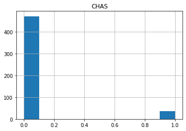
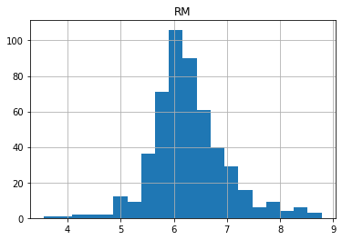
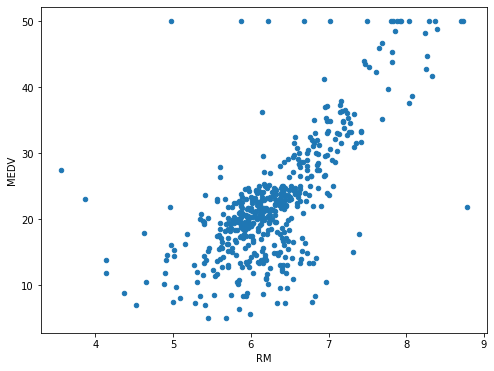
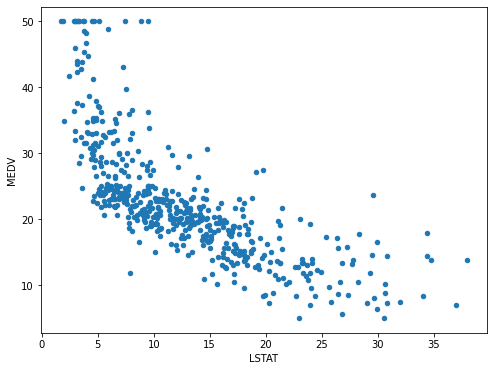

## Basic Functions

Example of exploratory data analysis using the Boston Housing Dataset

### Shape and Columns
``` py
from sklearn.datasets import load_boston
boston_dataset = load_boston()

import pandas as pd
boston = pd.DataFrame(boston_dataset.data, 
columns=boston_dataset.feature_names)

boston['MEDV'] = boston_dataset.target

print(boston.shape)
#There are 506 records, and 14 columns including 13 features and the target.
print(boston.columns)
```
```
(506, 14)
Index(['CRIM', 'ZN', 'INDUS', 'CHAS', 'NOX', 'RM', 'AGE', 'DIS', 'RAD', 'TAX',
       'PTRATIO', 'B', 'LSTAT', 'MEDV'],
      dtype='object')
```
### Head and Tail
``` py
boston[['CHAS','RM','AGE','RAD','MEDV']].head()
```
```
	CHAS	RM	    AGE	    RAD	    MEDV
0	0.0	    6.575	65.2	1.0	    24.0
1	0.0	    6.421	78.9	2.0	    21.6
2	0.0	    7.185	61.1	2.0	    34.7
3	0.0	    6.998	45.8	3.0	    33.4
4	0.0	    7.147	54.2	3.0	    36.2
```
Often datasets are loaded from other file formats (e.g., csv, text), it is a good practice to check the first and last few rows of the dataframe and make sure the data is in a consistent format using head and tail, respectively.

### Describe
``` py
#To check the summary statistics of the dataset (round to the second decimal place for better display)
boston.describe().round(2)
```

||CRIM|ZN|INDUS|CHAS|NOX|RM|AGE|DIS|RAD|TAX|PTRATIO|B|LSTAT|MEDV|
|:--|:--|:-:|:-:|:-:|:-:|:-:|:-:|:-:|:-:|:-:|:-:|:-:|:-:|:-:|
|count|	506.00|	506.00|	506.00|	506.00|	506.00|	506.00|	506.00|	506.00|	506.00|	506.00|	506.00|	506.00|	506.00|	506.00|
|mean|	3.61|	11.36|	11.14|	0.07|	0.55|	6.28|	68.57|	3.80|	9.55|	408.24|	18.46|	356.67|	12.65|	22.53|
|std|	8.60|	23.32|	6.86|	0.25|	0.12|	0.70|	28.15|	2.11|	8.71|	168.54|	2.16|	91.29|	7.14|	9.20|
|min|	0.01|	0.00|	0.46|	0.00|	0.38|	3.56|	2.90|	1.13|	1.00|	187.00|	12.60|	0.32|	1.73|	5.00|
|25%|	0.08|	0.00|	5.19|	0.00|	0.45|	5.89|	45.02|	2.10|	4.00|	279.00|	17.40|	375.38|	6.95|	17.02|
|50%|	0.26|	0.00|	9.69|	0.00|	0.54|	6.21|	77.50|	3.21|	5.00|	330.00|	19.05|	391.44|	11.36|	21.20|
|75%|	3.68|	12.50|	18.10|	0.00|	0.62|	6.62|	94.07|	5.19|	24.00|	666.00|	20.20|	396.22|	16.96|	25.00|
|max|	88.98|	100.00|	27.74|	1.00|	0.87|	8.78|	100.00|	12.13|	24.00|	711.00|	22.00|	396.90|	37.97|	50.00|

## Plot
### Hist
``` py
import matplotlib.pyplot as plt

boston.hist(column='CHAS')
plt.show()
```



``` py
boston.hist(column='RM',bins=20)
plt.show()
```



The distribution of RM appears normal and symmetric. The symmetry aligns with what we observed from the output of describe(), as the mean of RM 6.28 is close to its median 6.21.

### Scatter

We specify the type of the plot by passing a string ‘scatter’ to the argument kind, identify the labels for x and y respectively, and set the size of the figure via a tuple (width, height) in inches.

``` py
boston.plot(kind='scatter',
            x= 'RM',
            y = 'MEDV',
            figsize=(8,6));
```



``` py
boston.plot(kind='scatter',
            x= 'LSTAT',
            y = 'MEDV',
            figsize=(8,6));
```



## Correlation Matrix

To understand the relationship among features (columns), a correlation matrix is very useful in the exploratory data analysis. Correlation measures linear relationships between variables.

``` py
corr_matrix=boston.corr().round(2)
print(corr_matrix)
```
```
        CRIM    ZN  INDUS  CHAS   NOX  ...   TAX  PTRATIO     B  LSTAT  MEDV
CRIM     1.00 -0.20   0.41 -0.06  0.42  ...  0.58     0.29 -0.39   0.46 -0.39
ZN      -0.20  1.00  -0.53 -0.04 -0.52  ... -0.31    -0.39  0.18  -0.41  0.36
INDUS    0.41 -0.53   1.00  0.06  0.76  ...  0.72     0.38 -0.36   0.60 -0.48
CHAS    -0.06 -0.04   0.06  1.00  0.09  ... -0.04    -0.12  0.05  -0.05  0.18
NOX      0.42 -0.52   0.76  0.09  1.00  ...  0.67     0.19 -0.38   0.59 -0.43
RM      -0.22  0.31  -0.39  0.09 -0.30  ... -0.29    -0.36  0.13  -0.61  0.70
AGE      0.35 -0.57   0.64  0.09  0.73  ...  0.51     0.26 -0.27   0.60 -0.38
DIS     -0.38  0.66  -0.71 -0.10 -0.77  ... -0.53    -0.23  0.29  -0.50  0.25
RAD      0.63 -0.31   0.60 -0.01  0.61  ...  0.91     0.46 -0.44   0.49 -0.38
TAX      0.58 -0.31   0.72 -0.04  0.67  ...  1.00     0.46 -0.44   0.54 -0.47
PTRATIO  0.29 -0.39   0.38 -0.12  0.19  ...  0.46     1.00 -0.18   0.37 -0.51
B       -0.39  0.18  -0.36  0.05 -0.38  ... -0.44    -0.18  1.00  -0.37  0.33
LSTAT    0.46 -0.41   0.60 -0.05  0.59  ...  0.54     0.37 -0.37   1.00 -0.74
MEDV    -0.39  0.36  -0.48  0.18 -0.43  ... -0.47    -0.51  0.33  -0.74  1.00

[14 rows x 14 columns]
```
