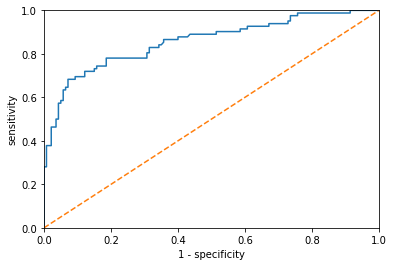
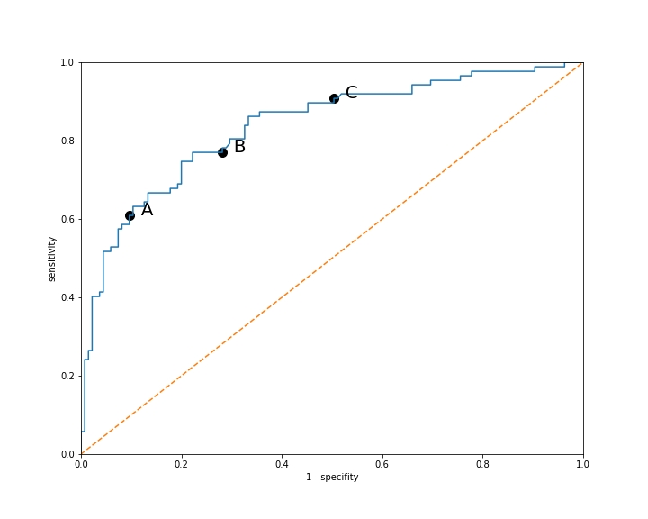

## Titanic

Prep Data with Pandas

``` py
import pandas as pd 
import matplotlib.pyplot as plt
df = pd.read_csv('titanic.csv')
df['male'] = df['Sex'] == 'male'
X = df[['Pclass', 'male', 'Age', 'Siblings/Spouses', 'Parents/Children', 'Fare']].values
y = df['Survived'].values
print(X)
print(y)
```
Build a Logistic Regression Model with Sklearn

``` py
from sklearn.linear_model import LogisticRegression
model = LogisticRegression()
X = df[['Fare', 'Age']].values
y = df['Survived'].values
model.fit(X, y)
print(model.coef_, model.intercept_)
```
```
[[ 0.01615949 -0.01549065]] [-0.51037152]
```

These values mean that the equation is as follows: 0 = 0.0161594x + -0.01549065y + -0.51037152


Make Predictions with the Model (with all the variables)

``` py
X = df[['Pclass', 'male', 'Age', 'Siblings/Spouses', 'Parents/Children', 'Fare']].values
y = df['Survived'].values
model = LogisticRegression()
model.fit(X, y)
#predict
print(model.predict([[3, True, 22.0, 1, 0, 7.25]])) 
print(model.predict(X[:5])) 
print(y[:5]) 

print(model.score(X,y)) #model accuracy
```
```
[0]
[0 1 1 1 0]
[0 1 1 1 0]
0.8049605411499436  
```

## Breast Cancer Dataset

``` py
from sklearn.datasets import load_breast_cancer
import pandas as pd

cancer_data = load_breast_cancer()
#print(cancer_data.keys())
#print(cancer_data['DESCR'])

df=pd.DataFrame(cancer_data['data'],columns=cancer_data['feature_names'])
df['target']=cancer_data['target']
print(df.head())

X = df[cancer_data.feature_names].values
y = df['target'].values

model = LogisticRegression(solver='liblinear')#needed to avoid iterations limit
model.fit(X, y)

model.predict([X[0]])#prediction for datapoint 0

model.score(X, y) #Accuracy is the percent of predictions that are correct.
```
```
   mean radius  mean texture  mean perimeter  ...  worst symmetry  \
0        17.99         10.38          122.80  ...          0.4601   
1        20.57         17.77          132.90  ...          0.2750   
2        19.69         21.25          130.00  ...          0.3613   
3        11.42         20.38           77.58  ...          0.6638   
4        20.29         14.34          135.10  ...          0.2364   

   worst fractal dimension  target  
0                  0.11890       0  
1                  0.08902       0  
2                  0.08758       0  
3                  0.17300       0  
4                  0.07678       0  

[5 rows x 31 columns]
0.9595782073813708
```

Accuracy is a good measure if our classes are evenly split, but is very misleading if we have imbalanced classes. Always use caution with accuracy. You need to know the distribution of the classes to know how to interpret the value.


## Metrics

The **Confusion Matrix** is a table showing four values:

+ Datapoints we predicted positive that are actually positive: true positive (TP)
+ Datapoints we predicted positive that are actually negative: true negative (TN)
+ Datapoints we predicted negative that are actually positive: false positive (FP)
+ Datapoints we predicted negative that are actually negative: false negative (FN)

The confusion matrix fully describes how a model performs on a dataset, though is difficult to use to compare models.


**Precision** is a measure of how precise the model is with its positive predictions.

Precision = TP / ( TP + FP)

**Recall** is the percent of positive cases that the model predicts correctly.

Recall = TP / (TP + FN)

We often will be in a situation of choosing between increasing the recall (while lowering the precision) or increasing the precision (and lowering the recall). There’s no hard and fast rule on what values of precision and recall you’re shooting for. It always depends on the dataset and the application.

**F1 Score**

Accuracy was an appealing metric because it was a single number. Precision and recall are two numbers so it’s not always obvious how to choose between two models if one has a higher precision and the other has a higher recall. The F1 score is an average of precision and recall so that we have a single score for our model. The F1 score is the harmonic mean of the precision and recall values.

F1 = 2*(precision*recall)/(precision + recall)

Scikit-learn has a confusion matrix function. Scikit-learn reverses the confusion matrix to show the negative counts first! 
Since negative target values correspond to 0 and positive to 1, scikit-learn has ordered them in this order. Make sure you double check that you are interpreting the values correctly!

``` py
import pandas as pd
from sklearn.linear_model import LogisticRegression
df = pd.read_csv('titanic.csv')
df['male'] = df['Sex'] == 'male'
X = df[['Pclass', 'male', 'Age', 'Siblings/Spouses', 'Parents/Children', 'Fare']].values
y = df['Survived'].values
model = LogisticRegression()
model.fit(X, y)
y_pred = model.predict(X)

from sklearn.metrics import accuracy_score, precision_score, recall_score, f1_score, confusion_matrix

print("Accuracy :",accuracy_score(y,y_pred))
print("Precision :",precision_score(y,y_pred))
print("Recall :",recall_score(y,y_pred))
print("F1 :",f1_score(y,y_pred))

#Confusion matrix 
print(confusion_matrix(y,y_pred))
#Confusion matrix is not in standard view, negative counts are first
```
```
Accuracy : 0.8049605411499436
Precision : 0.7734627831715211
Recall : 0.6988304093567251
F1 : 0.7342549923195083
[[475  70]
 [103 239]]
```

## Training and Testing

Models can suffer from either:

**Overfitting**: capturing spurious patterns that won't recur in the future, leading to less accurate predictions, or

**Underfitting**: failing to capture relevant patterns, again leading to less accurate predictions.
We use validation data, which isn't used in model training, to measure a candidate model's accuracy. This lets us try many candidate models and keep the best one.

**Overfitting** is when we perform well on the data the model has already seen, but we don’t perform well on new data.

To simulate making predictions on new unseen data, we can break our dataset into a training set and a test set. The training set is used for building the models. The test set is used for evaluating the models. We split our data before building the model, thus the model has no knowledge of the test set and we’ll be giving it a fair assessment.

A standard breakdown is to put 70-80% of our data in the training set and 20-30% in the test set. Using less data in the training set means that our model won’t have as much data to learn from, so we want to give it as much as possible while still leaving enough for evaluation.

**train_test_split** function will randomly put each datapoint in either the training set or the test set. By default the training set is 75% of the data and the test set is the remaining 25% of the data. We can change the size of our training set by using the train_size parameter. E.g. **train_test_split(X, y, train_size=0.6)** would put 60% of the data in the training set and 40% in the test set.

Our accuracy, precision, recall and F1 score values are actually very similar to the values when we used the entire dataset. This is a sign our model is not overfit!

``` py
from sklearn.model_selection import train_test_split
X_train, X_test, y_train, y_test = train_test_split(X, y)
print("whole dataset:", X.shape, y.shape)
print("training set:", X_train.shape, y_train.shape)
print("test set:", X_test.shape, y_test.shape)
```
```
whole dataset: (887, 6) (887,)
training set: (665, 6) (665,)
test set: (222, 6) (222,)
```

``` py
import pandas as pd
from sklearn.linear_model import LogisticRegression
df = pd.read_csv('titanic.csv')
df['male'] = df['Sex'] == 'male'
X = df[['Pclass', 'male', 'Age', 'Siblings/Spouses', 'Parents/Children', 'Fare']].values
y = df['Survived'].values
model = LogisticRegression()
model.fit(X_train, y_train)
y_pred = model.predict(X_test)
print(model.score(X_test, y_test))

print("Accuracy :",accuracy_score(y_test,y_pred))
print("Precision :",precision_score(y_test,y_pred))
print("Recall :",recall_score(y_test,y_pred))
print("F1 :",f1_score(y_test,y_pred))
```
```
0.8018018018018018
Accuracy : 0.8018018018018018
Precision : 0.8108108108108109
Recall : 0.6666666666666666
F1 : 0.7317073170731707
```

To get the same split every time, we can use the random_state attribute. We choose an arbitrary number to give it, and then every time we run the code, we will get the same split. The random state is also called a seed.

``` py
from sklearn.model_selection import train_test_split
X=[[1,1],[2,2],[3,3],[4,4]]
y=[0,0,1,1]

#X_train, X_test, y_train, y_test = train_test_split(X, y)
#with a seed
X_train, X_test, y_train, y_test = train_test_split(X, y,random_state=27)

print("X_train",X_train)
print("X_test",X_test)
```
```
X_train [[3, 3], [1, 1], [4, 4]]
X_test [[2, 2]]
```

An **ROC Curve** is a graph of the **sensitivity** vs. the **specificity**. These values demonstrate the same trade-off that precision and recall demonstrate.

The **sensitivity** is another term for the recall, which is the true positive rate.

The **specificity** is the true negative rate.
TN / (TN + FP)

The goal is to maximize these two values, though generally making one larger makes the other lower. It will depend on the situation whether we put more emphasis on sensitivity or specificity.


``` py
import pandas as pd
from sklearn.linear_model import LogisticRegression
from sklearn.model_selection import train_test_split
from sklearn.metrics import recall_score, precision_recall_fscore_support

sensitivity_score = recall_score
def specificity_score(y_true, y_pred):
    p, r, f, s = precision_recall_fscore_support(y_true, y_pred)
    return r[0]


df = pd.read_csv('titanic.csv')
df['male'] = df['Sex'] == 'male'
X = df[['Pclass', 'male', 'Age', 'Siblings/Spouses', 'Parents/Children', 'Fare']].values
y = df['Survived'].values

X_train, X_test, y_train, y_test = train_test_split(X, y,random_state=5)

model = LogisticRegression()
model.fit(X_train, y_train)
y_pred = model.predict(X_test)

print(model.score(X_test, y_test))
print(sensitivity_score(y_test, y_pred)) 
print(specificity_score(y_test, y_pred)) 
```
```
0.8333333333333334
0.6829268292682927
0.9214285714285714
```

**Adjusting the Logistic Regression Threshold in Sklearn**

When you use scikit-learn’s predict method, you are given 0 and 1 values of the prediction. However, behind the scenes the Logistic Regression model is getting a probability value between 0 and 1 for each datapoint and then rounding to either 0 or 1. If we want to choose a different threshold besides 0.5, we’ll want those probability values. We can use the predict_proba function to get them.

```
(model.predict_proba(X_test)
```
The result is a numpy array with 2 values for each datapoint (e.g. [0.78, 0.22]). You’ll notice that the two values sum to 1. The first value is the probability that the datapoint is in the 0 class (didn’t survive) and the second is the probability that the datapoint is in the 1 class (survived). We only need the second column of this result, which we can pull with the following numpy syntax.

```
model.predict_proba(X_test)[:, 1]
```

``` py
import pandas as pd
from sklearn.linear_model import LogisticRegression
from sklearn.model_selection import train_test_split
from sklearn.metrics import recall_score, precision_recall_fscore_support

sensitivity_score = recall_score
def specificity_score(y_true, y_pred):
    p, r, f, s = precision_recall_fscore_support(y_true, y_pred)
    return r[0]


df = pd.read_csv('titanic.csv')
df['male'] = df['Sex'] == 'male'
X = df[['Pclass', 'male', 'Age', 'Siblings/Spouses', 'Parents/Children', 'Fare']].values
y = df['Survived'].values

X_train, X_test, y_train, y_test = train_test_split(X, y,random_state=5)

model = LogisticRegression()
model.fit(X_train, y_train)
y_pred = model.predict(X_test)

#A threshold of 0.75 means we need to be more confident in order to make a positive prediction. 
#This results in fewer positive predictions and more negative predictions.
#Setting the threshold to 0.5 we would get 
#the original Logistic Regression model. 
#Any other threshold value yields an alternative model.
y_pred = model.predict_proba(X_test)[:, 1] > 0.75
print(model.score(X_test, y_test))
print(sensitivity_score(y_test, y_pred)) 
print(specificity_score(y_test, y_pred))
```
```
0.8333333333333334
0.43902439024390244
0.9785714285714285
```

## ROC Curve

The ROC curve is a graph of the specificity vs the sensitivity. We build a Logistic Regression model and then calculate the specificity and sensitivity for every possible threshold. Every predicted probability is a threshold. Note that we actually plot the sensitivity vs (1-specificity). There is no strong reason for doing it this way besides that it’s the standard.

Scikit-learn has a roc_curve function we can use. The function takes the true target values and the predicted probabilities from our model. We first use the predict_proba method on the model to get the probabilities. Then we call the roc_curve function. The roc_curve function returns an array of the false positive rates, an array of the true positive rates and the thresholds. The false positive rate is 1-specificity (x-axis) and the true positive rate is another term for the sensitivity (y-axis). The threshold values won’t be needed in the graph.

Here’s the code for plotting the ROC curve in matplotlib. Note that we also have code for plotting a diagonal line. This can help us visually see how far our model is from a model that predicts randomly.

As we don’t use the threshold values to build the graph, the graph does not tell us what threshold would yield each of the possible models.

``` py
import pandas as pd
from sklearn.linear_model import LogisticRegression
from sklearn.model_selection import train_test_split
from sklearn.metrics import recall_score, precision_recall_fscore_support, roc_curve
import matplotlib.pyplot as plt


sensitivity_score = recall_score
def specificity_score(y_true, y_pred):
    p, r, f, s = precision_recall_fscore_support(y_true, y_pred)
    return r[0]


df = pd.read_csv('titanic.csv')
df['male'] = df['Sex'] == 'male'
X = df[['Pclass', 'male', 'Age', 'Siblings/Spouses', 'Parents/Children', 'Fare']].values
y = df['Survived'].values

X_train, X_test, y_train, y_test = train_test_split(X, y,random_state=5)

model = LogisticRegression()
model.fit(X_train, y_train)
y_pred_proba = model.predict_proba(X_test)
fpr, tpr, thresholds = roc_curve(y_test, y_pred_proba[:,1])

plt.plot(fpr, tpr)
plt.plot([0, 1], [0, 1], linestyle='--')
plt.xlim([0.0, 1.0])
plt.ylim([0.0, 1.0])
plt.xlabel('1 - specificity')
plt.ylabel('sensitivity')
plt.show()

```




The ROC curve is showing the performance, not of a single model, but of many models. Each choice of threshold is a different model.

Each point A, B & C refers to a model with a different threshold.



Model A has a sensitivity of 0.6 and a specificity of 0.9 (recall that the graph is showing 1-specificity). Model B has a sensitivity of 0.8 and a specificity of 0.7. Model C has a sensitivity of 0.9 and a specificity of 0.5.

How to choose between these models will depend on the specifics of our situation. The closer the curve gets to the upper left corner, the better the performance. The line should never fall below the diagonal line as that would mean it performs worse than a random model.

If we are in a situation where it’s more important that all of our positive predictions are correct than that we catch all the positive cases (meaning that we predict most of the negative cases correctly), we should choose the model with higher specificity (model A).

If we are in a situation where it’s important that we catch as many of the positive cases as possible, we should choose the model with the higher sensitivity (model C).

If we want a balance between sensitivity and specificity, we should choose model B.

The Area Under the Curve, the AUC,is a value between 0 and 1, the higher the better. Since the ROC is a graph of all the different Logistic Regression models with different thresholds, the AUC does not measure the performance of a single model. It gives a general sense of how well the Logistic Regression model is performing. To get a single model, you still need to find the optimal threshold for your problem.

It’s important to note that this metric tells us how well in general a Logistic Regression model performs on our data. As an ROC curve shows the performance of multiple models, the AUC is not measuring the performance of a single model.

``` py
import pandas as pd
from sklearn.linear_model import LogisticRegression
from sklearn.model_selection import train_test_split
from sklearn.metrics import roc_auc_score

df = pd.read_csv('titanic.csv')
df['male'] = df['Sex'] == 'male'
X = df[['Pclass', 'male', 'Age', 'Siblings/Spouses', 'Parents/Children', 'Fare']].values
y = df['Survived'].values

X_train, X_test, y_train, y_test = train_test_split(X, y,random_state=5)

model1 = LogisticRegression()
model1.fit(X_train, y_train)
y_pred_proba1 = model1.predict_proba(X_test)
print("Model 1 AUC score: ",roc_auc_score(y_test,y_pred_proba1[:,1]))

#model2 with just Pclass and male features.
model2 = LogisticRegression()
model2.fit(X_train[:,0:2], y_train)
y_pred_proba2 = model2.predict_proba(X_test[:,0:2])
print("Model 2 AUC score: ",roc_auc_score(y_test,y_pred_proba2[:,1]))

```
```
Model 1 AUC score:  0.8572299651567944
Model 2 AUC score:  0.8390679442508711
```

## K-fold Cross Validation

Instead of doing a single train/test split, we’ll split our data into a training set and test set multiple times. You will only see values this different when you have a small dataset. With large datasets we often just do a training and test set for simplicity. This process for creating multiple training and test sets is called k-fold cross validation. The k is the number of chunks we split our dataset into. The standard number is 5. Our goal in cross validation is to get accurate measures for our metrics (accuracy, precision, recall). We are building extra models in order to feel confident in the numbers we calculate and report.

These 5 models were built just for evaluation purposes, so that we can report the metric values. We don’t actually need these models and want to build the best possible model. The best possible model is going to be a model that uses all of the data. So we keep track of our calculated values for our evaluation metrics and then build a model using all of the data.


``` py
from sklearn.model_selection import KFold
import pandas as pd

df = pd.read_csv('titanic.csv')
X = df[[ 'Age', 'Fare']].values[:6]
y = df['Survived'].values[:6]

kf = KFold(n_splits=3, shuffle=True)
for train,test in kf.split(X):
  print(train,test)
#3 training and testing sets as expected
```
```
[0 2 3 4] [1 5]
[1 2 4 5] [0 3]
[0 1 3 5] [2 4]
```

``` py
from sklearn.model_selection import KFold
import pandas as pd

df = pd.read_csv('titanic.csv')
X = df[[ 'Age', 'Fare']].values[:6]
y = df['Survived'].values[:6]

kf = KFold(n_splits=3, shuffle=True)
splits=list(kf.split(X))
first_split=splits[0]
train_indices,test_indices=first_split
print("training set indices",train_indices)
print("test set indices", test_indices)

X_train=X[train_indices]
X_test=X[test_indices]
y_train=y[train_indices]
y_test=y[test_indices]

print("X train")
print(X_train)
print("y_train",y_train)
print("X test")
print(X_test)
print("y_test",y_test)
```
```
training set indices [0 1 3 5]
test set indices [2 4]
X train
[[22.      7.25  ]
 [38.     71.2833]
 [35.     53.1   ]
 [27.      8.4583]]
y_train [0 1 1 0]
X test
[[26.     7.925]
 [35.     8.05 ]]
y_test [1 0]
```

``` py
from sklearn.model_selection import KFold
import numpy as np
from sklearn.linear_model import LogisticRegression
import pandas as pd

df = pd.read_csv('titanic.csv')
df['male'] = df['Sex'] == 'male'
X = df[['Pclass', 'male', 'Age', 'Siblings/Spouses', 'Parents/Children', 'Fare']].values
y = df['Survived'].values

scores = []
kf = KFold(n_splits=5, shuffle=True)

for train_index, test_index in kf.split(X):
  X_train,  X_test = X[train_indices], X[test_indices]
  y_train, y_test  = y[train_indices], y[test_indices]
  model = LogisticRegression()
  model.fit(X_train, y_train)
  scores.append(model.score(X_test,y_test))

print(scores)
print(np.mean(scores))
```
```
[0.7584269662921348, 0.7584269662921348, 0.7584269662921348, 0.7584269662921348, 0.7584269662921348]
0.7584269662921348
```