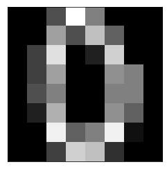

Neural networks often work well without you needing to use domain knowledge to do any feature engineering.

There are three commonly used activation functions: 

+ Sigmoid 
+ Tanh 
+ ReLU

Tanh has a similar form to sigmoid, though ranges from -1 to 1 instead of 0 to 1. Tanh is the hyperbolic tan function. 

ReLU stands for Rectified Linear Unit. It is the identity function for positive numbers and sends negative numbers to 0. 


Any of these activation functions will work well. Which one to use will depend on specifics of our data. In practice, we figure out which one to use by comparing the performance of different neural networks.

## Multi-Layer Perceptron

Multi-Layer Perceptron (MLP) are feed forward neural networks which means that the neurons only send signals in one direction. A single-layer perceptron is a neural network without any hidden layers. These are rarely used. Most neural networks are multi-layer perceptrons, generally with one or two hidden layers.

In order to train a neural network, we need to define a **loss function**. This is a measure of how far off our neural network is from being perfect. When we train the neural network, we are optimizing a loss function.

We will use cross entropy as our loss function. This is the same as the likelihood we used in logistic regression but is called by a different name in this context. Just like we did with the likelihood function in logistic regression, we use the loss function to find the best possible model.

### Backpropagation

A neural network has a lot of parameters that we can control. There are several coefficients for each node and there can be a lot of nodes. The neural network works backwards from the output node iteratively updating the coefficients of the nodes. This process of moving backwards through the neural network is called backpropagation or backprop. Before we create a neural network we fix the number of nodes and number of layers. Then we use backprop to iteratively update all the coefficient values until we converge on an optimal neural network.

``` py
'''
Scikit-learn has a couple other functions besides make_classification 
for making classification datasets with different properties. 
Look at make_circles and make_moons if you want to play around with more artificial datasets.
the make_classification function in scikit-learn. It generates a feature matrix X and target array y. We will give it these parameters:

• n_samples: number of datapoints
• n_features: number of features
• n_informative: number of informative features
• n_redundant: number of redundant features
• random_state: random state to guarantee same result every time

'''
from sklearn.datasets import make_classification
X,y=make_classification(n_features=2,n_redundant=0,n_informative=2,random_state=3)

from matplotlib import pyplot as plt
plt.scatter(X[y==0][:, 0], X[y==0][:, 1], s=100, edgecolors='k')
plt.scatter(X[y==1][:, 0], X[y==1][:, 1], s=100, edgecolors='k', marker='^')
plt.show()
```


``` py
from sklearn.model_selection import train_test_split
from sklearn.neural_network import MLPClassifier

X_train, X_test, y_train, y_test = train_test_split(X, y, random_state=3)
mlp = MLPClassifier(max_iter=1000, hidden_layer_sizes=(100, 50), alpha=0.0001,solver='adam',random_state=3)
mlp.fit(X_train,y_train)
print("Accuracy: ",mlp.score(X_test,y_test))
```
```
Accuracy:  0.76
```

## MNIST

``` py
from sklearn.datasets import load_digits
X, y = load_digits(n_class=2, return_X_y=True)
print(X.shape, y.shape)
print(X[0].reshape(8, 8))
print(y[0])

import matplotlib.pyplot as plt
from sklearn.datasets import load_digits

X, y = load_digits(n_class=2, return_X_y=True)
plt.matshow(X[0].reshape(8, 8), cmap=plt.cm.gray)
plt.xticks(())  # remove x tick marks
plt.yticks(())  # remove y tick marks
plt.show()

```
```
(360, 64) (360,)
[[ 0.  0.  5. 13.  9.  1.  0.  0.]
 [ 0.  0. 13. 15. 10. 15.  5.  0.]
 [ 0.  3. 15.  2.  0. 11.  8.  0.]
 [ 0.  4. 12.  0.  0.  8.  8.  0.]
 [ 0.  5.  8.  0.  0.  9.  8.  0.]
 [ 0.  4. 11.  0.  1. 12.  7.  0.]
 [ 0.  2. 14.  5. 10. 12.  0.  0.]
 [ 0.  0.  6. 13. 10.  0.  0.  0.]]
0
```


``` py
X_train, X_test, y_train, y_test = train_test_split(X, y, random_state=2)
mlp = MLPClassifier()
mlp.fit(X_train, y_train)
x = X_test[0]
plt.matshow(x.reshape(8, 8), cmap=plt.cm.gray)
plt.xticks(())
plt.yticks(())
plt.show()
print(mlp.predict([x]))
# 0

print(mlp.score(X_test,y_test))#100% accuracy 
```

```
[0]
1.0
```
### All numbers
``` py
from sklearn.datasets import load_digits
X, y = load_digits(return_X_y=True)
X_train, X_test, y_train, y_test = train_test_split(X, y, random_state=2)
mlp = MLPClassifier(random_state=2)
mlp.fit(X_train, y_train)
print(mlp.score(X_test,y_test))

##The incorrect
y_pred = mlp.predict(X_test)
incorrect = X_test[y_pred != y_test]
incorrect_true = y_test[y_pred != y_test]
incorrect_pred = y_pred[y_pred != y_test] 

j = 0
plt.matshow(incorrect[j].reshape(8, 8), cmap=plt.cm.gray)
plt.xticks(())
plt.yticks(())
plt.show()
print("true value:", incorrect_true[j])
print("predicted value:", incorrect_pred[j])
```
```
0.96
```

```
true value: 4
predicted value: 9
```

## OpenML dataset

``` py
from sklearn.datasets import fetch_openml
X, y = fetch_openml('mnist_784', version=1, return_X_y=True)
```

``` py
import numpy as np


print(X.shape, y.shape)
print(np.min(X), np.max(X))
print(y[0:5])
#using only the digits 0-3
X5 = X[y <= '3']
y5 = y[y <= '3']

mlp=MLPClassifier(
  hidden_layer_sizes=(6,), 
  max_iter=200, alpha=1e-4,
  solver='sgd', random_state=2)

mlp.fit(X5, y5)
```
```
(70000, 784) (70000,)
0.0 255.0
['5' '0' '4' '1' '9']
MLPClassifier(activation='relu', alpha=0.0001, batch_size='auto', beta_1=0.9,
              beta_2=0.999, early_stopping=False, epsilon=1e-08,
              hidden_layer_sizes=(6,), learning_rate='constant',
              learning_rate_init=0.001, max_fun=15000, max_iter=200,
              momentum=0.9, n_iter_no_change=10, nesterovs_momentum=True,
              power_t=0.5, random_state=2, shuffle=True, solver='sgd',
              tol=0.0001, validation_fraction=0.1, verbose=False,
              warm_start=False
```

``` py
print(len(mlp.coefs_))
```
```
2
```

The two elements in the list correspond to the two layers: the hidden layer and the output layer. We have an array of coefficients for each of these layers. Let’s look at the shape of the coefficients for the hidden layer.

``` py
print(mlp.coefs_[0].shape)
```
```
(784, 6)
```

We see that we have a 2-dimensional array of size 784 x 6. There are 6 nodes and 784 input values feeding into each node, and we have a weight for each of these connections.

### Visualizing the Hidden Layer

``` py
fig, axes = plt.subplots(2, 3, figsize=(5, 4))
for i, ax in enumerate(axes.ravel()):
    coef = mlp.coefs_[0][:, i]
    ax.matshow(coef.reshape(28, 28), cmap=plt.cm.gray)
    ax.set_xticks(())
    ax.set_yticks(())
    ax.set_title(i + 1)
plt.show()
```


You can see that nodes 4 and 6 are determining if the digit is a 3. Node 1 is determining if the digit is a 0 or a 2 since you can see both of those values in the image. Not every hidden node will have an obvious use

## Interpretability

While we can visualize the nodes in the hidden layer to understand on a high level what the neural network is doing, it is impossible to answer the question "Why did datapoint x get prediction y?" Since there are so many nodes, each with their own coefficients, it is not feasible to get a simple explanation of what the neural network is doing. This makes it a difficult model to interpret and use in certain business use cases.

## Computation

Neural networks can take a decent amount of time to train. Each node has its own coefficients and to train they are iteratively updated, so this can be time consuming. However, they are parallelizable, so it is possible to throw computer power at them to make them train faster.

Once they are built, neural networks are not slow to make predictions, however, they are not as fast as some of the other models.

## Performance

The main draw to neural networks is their performance. On many problems, their performance simply cannot be beat by other models. They can take some tuning of parameters to find the optimal performance, but they benefit from needing minimal feature engineering prior to building the model.

A lot of simpler problems, you can achieve equivalent performance with a simpler model like logistic regression, but with large unstructured datasets, neural networks outperform other models.