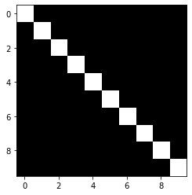

Much of plotting you'll do will be through the [Matplotlib](https://matplotlib.org/) library, specifically within the Pyplot module. matplotlib.pyplot is a collection of functions that make plotting in python work like MATLAB. Each function makes some change to a figure, e.g., creates a figure, creates a plotting area in a figure, plots lines, annotates the plots with labels, etc.

The style can be changed from classic to ggplot, mimicking the aesthetic style used in the R package ggplot2.

`plt.style.use('ggplot')`

For all matplotlib plots, first create a figure and an axes object; to show the plot, call “plt.show()”. The figure contains all the objects, including axes, graphics, texts, and labels. The axes is a bounding box with ticks and labels. Think of axes as an individual plot.

``` py
import matplotlib.pyplot as plt
fig=plt.figure()
ax=plt.axes()
plt.style.use('ggplot')
plt.show()

```


We can specify the x and y axis labels and a title using plt.xlabel(), plt.ylabel() and plt.title()

One can also set the limits of x- and y-axis using plt.xlim() and plt.ylim(), respectively.

To create a plot legend labeling each line. We can use the method plt.legend(), in conjunction with specifying labels in the plt.plot().

The color, line style (e.g., solid, dashed, etc.), and position, size, and style of labels can be modified using optional arguments to the function. For more details check the docstring of each function and the matplotlib [documentation](https://matplotlib.org/3.1.3/tutorials/index.html#colors).

Aptly named, the plot function is used to plot 2-D data, as shown below:

``` py
import numpy as np
import matplotlib.pyplot as plt

# We'll start with a parabola
# Compute the parabola's x and y coordinates
x = np.arange(-5, 5, 0.1)
y = np.square(x)

# Use matplotlib for the plot
plt.plot(x, y, 'b') # specify the color blue for the line
plt.xlabel('X-Axis Values')
plt.ylabel('Y-Axis Values')
plt.title('First Plot: A Parabola')
plt.show() # required to actually display the plot
```


## Imshow

Another Matplotlib function you'll encounter is imshow which is used to display images. Recall that an image may be considered as an array, with array elements indicating image pixel values. As a simple example, here is the identity matrix:

``` py
import numpy as np
import matplotlib.pyplot as plt

X = np.identity(10)
identity_matrix_image = plt.imshow(X, cmap="Greys_r")
plt.show()
```




``` py
# Now plot a random matrix, with a different colormap
A = np.random.randn(10, 10)
random_matrix_image = plt.imshow(A)
plt.show()
```


## Scatter Plot

A scatter plot is used to show all the values from your data on a graph. In order to get a visual representation of our data, we have to limit our data to two features. The purple dots are first class, the green dots are second class, and the yellow dots are third class.

``` py
import pandas as pd 
import matplotlib.pyplot as plt
df = pd.read_csv('titanic.csv')
plt.xlabel('Age')
plt.ylabel('Fare')
plt.scatter(df['Age'], df['Fare'])
plt.scatter(df['Age'], df['Fare'], c=df['Pclass'])
```


## Line Plot

Now that we can put individual datapoints on a plot, let's see how to draw the line. The plot function does just that. The following draws a line to approximately separate the 1st class from the 2nd and 3rd class. From eyeballing, we’ll put the line from (0, 85) to (80, 5). Our syntax below has a list of the x values and a list of the y values.

``` py
plt.plot([0, 80], [85, 5])
```


## Bar Plot

The plot() function can take a kind argument, specifying the type of the plot we want to produce.

For bar plots, provide kind="bar". kind="barh" can be used to create a horizontal bar chart. The stacked property can be used to specify if the bars should be stacked on top of each other.

``` py
import pandas as pd 
import matplotlib.pyplot as plt
df = pd.read_csv('titanic.csv')
(df.groupby('Survived')['Fare'].mean()).plot(kind='bar')
```


## Box Plot

A box plot is used to visualize the distribution of values in a column, basically visualizing the result of the describe() function.

The green line shows the median value. The box shows the upper and lower quartiles (25% of the data is greater or less than these values). The circles show the outliers, while the black lines show the min/max values excluding the outliers.

``` py
df[df['Survived']==1]["Fare"].plot(kind="box")
```


## Histogram

Similar to box plots, histograms show the distribution of data. Visually histograms are similar to bar charts, however, histograms display frequencies for a group of data rather than an individual data point; therefore, no spaces are present between the bars.

Typically, a histogram groups data into chunks (or bins). You can manually specify the number of bins to use using the bins attribute.

``` py
df[df['Survived']==1]["Fare"].plot(kind="hist", bins=10)
```


## Area Plot

``` py
df[df['Survived']==1]["Fare"].plot(kind="area")
```


## Pie Chart

Create a pie chart using kind="pie". Pie charts are generally used to show percentage or proportional data. Pie charts are usually used when you have up to 6 categories.

``` py
df.groupby("Survived")["Fare"].sum().plot(kind="pie")
```

