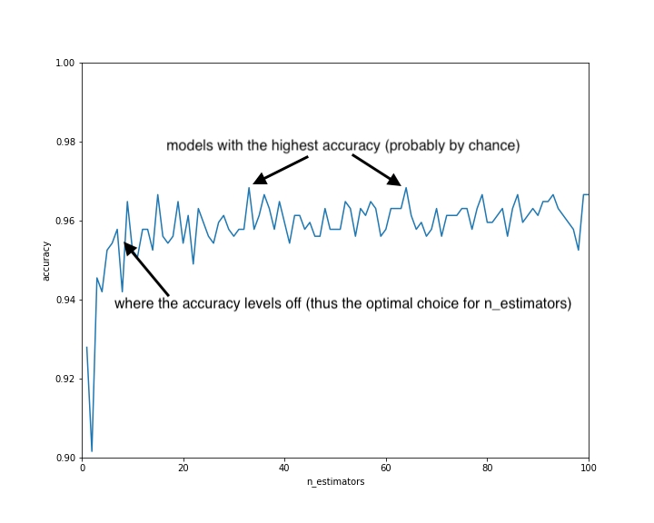

Decision Trees are very susceptible to random idiosyncrasies in the training dataset. We say that Decision Trees have high variance since if you randomly change the training dataset, you may end up with a very different looking tree.

One of the advantages of decision trees over a model like logistic regression is that they make no assumptions about how the data is structured. In logistic regression, we assume that we can draw a line to split the data. Sometimes our data just isn’t structured like that. A decision tree has the potential to get at the essence of the data no matter how it is structured.

The goal of random forests is to take the advantages of decision trees while mitigating the variance issues.

A random forest is an example of an ensemble because it uses multiple machine learning models to create a single model.

## Bootstrapping

A bootstrapped sample is a random sample of datapoints where we randomly select with replacement datapoints from our original dataset to create a dataset of the same size. Randomly selecting with replacement means that we can choose the same datapoint multiple times. This means that in a bootstrapped sample, some datapoints from the original dataset will appear multiple times and some will not appear at all.

For example if we have four datapoints A, B, C, D, these could be 3 resamples:

A, A, B, C

B, B, B, D

A, A, C, C

We would rather be able to get more samples of data from the population, but as all we have is our training set, we use that to generate additional datasets.

We use bootstrapping to mimic creating multiple samples.

### Bagging

**Bootstrap Aggregation (or Bagging)** is a technique for reducing the variance in an individual model by creating an ensemble from multiple models built on bootstrapped samples.

To bag decision trees, we create multiple (say 10) bootstrapped resamples of our training dataset. So if we have 100 datapoints in our training set, each of the resamples will have 100 datapoints randomly chosen from our training set. Recall that we randomly select with replacement, meaning that some datapoints will appear multiple times and some not at all.

We create a decision tree with each of these 10 resamples.

To make a prediction, we make a prediction with each of the 10 decision trees and then each decision tree gets a vote. The prediction with the most votes is the final prediction.

When we bootstrap the training set, we're trying to wash out the variance of the decision tree. The average of several trees that have different training sets will create a model that more accurately gets at the essence of the data.

With bagged decision trees, the trees may still be too similar to have fully created the ideal model. They are built on different resamples, but they all have access to the same features. Thus we will add some restrictions to the model when building each decision tree so the trees have more variation. We call this decorrelating the trees.

If you recall, when building a decision tree, at every node, we compare all the split thresholds for each feature to find the single best feature & split threshold. In a decision tree for a random forest, at each node, we randomly select a subset of the features to consider. This will result in us choosing a good, but not the best, feature to split on at each step. It’s important to note that the random selection of features happens at each node. So maybe at the first node we consider the Sex and Fare features and then at the second node, the Fare and Age features.

A standard choice for the number of features to consider at each split is the square root of the number of features. So if we have 9 features, we will consider 3 of them at each node (randomly chosen).

If we bag these decision trees, we get a random forest. Each decision tree within a random forest is probably worse than a standard decision tree. But when we average them we get a very strong model!

``` py
import pandas as pd
from sklearn.datasets import load_breast_cancer
from sklearn.ensemble import RandomForestClassifier
from sklearn.model_selection import train_test_split


cancer_data= load_breast_cancer()
df= pd.DataFrame(cancer_data['data'], columns=cancer_data['feature_names'])
df['target']=cancer_data['target']

X=df[cancer_data.feature_names].values
y=df['target'].values

X_train, X_test, y_train, y_test = train_test_split(X, y, random_state=101)

print('data dimensions',X.shape)
#569 datapoints, 30 features

rf = RandomForestClassifier()
rf.fit(X_train, y_train)

first_row=X_test[0]
print("Prediction: ",rf.predict([first_row]))
print("True value: ", y_test[0])

print("RF accuracy:", rf.score(X_test,y_test))
```
```
data dimensions (569, 30)
Prediction:  [1]
True value:  1
RF accuracy: 0.972027972027972
```

## Random Forest Parameters

One of the big advantages of Random Forests is that they rarely require much tuning. The default values will work well on most datasets.
Tuning parameters for prepruning as we did for decision trees: max_depth, min_samples_leaf, and max_leaf_nodes. With random forests, it is generally not important to tune these as overfitting is generally not an issue.

Two new tuning parameters: 

* n_estimators (the number of trees) 
* max_features (the number of features to consider at each split).

The default for the max features is the square root of p, where p is the number of features (or predictors). The default is generally a good choice for max features and we usually will not need to change it, but you can set it to a fixed number with the following code.

``` py
rf = RandomForestClassifier(max_features=5)
```

The default number of estimators (decision trees) is 10. This often works well but may in some cases be too small. You can set it to another number as follows. We will see in the next parts how to choose the best value.

``` py
rf = RandomForestClassifier(n_estimators=15)
```

You can add additional parameters, e.g. max_features, and parameter values to the param_grid dictionary to compare more decision trees.

``` py
from sklearn.model_selection import GridSearchCV
param_grid = {
    'n_estimators': [10, 25, 50, 75, 100],
}

rf = RandomForestClassifier()
gs = GridSearchCV(rf, param_grid, cv=5)

gs.fit(X,y)
print("best params:", gs.best_params_)
```
```
best params: {'n_estimators': 25}
```

## Elbow Graph

With a parameter like the number of trees in a random forest, increasing the number of trees will never hurt performance. Increasing the number trees will increase performance until a point where it levels out. The more trees, however, the more complicated the algorithm. A more complicated algorithm is more resource intensive to use. Generally it is worth adding complexity to the model if it improves performance but we do not want to unnecessarily add complexity.

We can use what is called an Elbow Graph to find the sweet spot. Elbow Graph is a model that optimizes performance without adding unnecessary complexity.

To find the optimal value, let’s do a Grid Search trying all the values from 1 to 100 for n_estimators.


``` py
n_estimators = list(range(1, 101))
param_grid = {
    'n_estimators': n_estimators,
}
rf = RandomForestClassifier()
gs = GridSearchCV(rf, param_grid, cv=5)
gs.fit(X, y)

```


Instead of just looking at the best params like we did before, we are going to use the entire result from the grid search. The values are located in the cv_results_ attribute. This is a dictionary with a lot of data, however, we will only need one of the keys: mean_test_score. Let’s pull out these values and store them as a variable.


``` py
import matplotlib.pyplot as plt

scores = gs.cv_results_['mean_test_score']
plt.plot(n_estimators, scores)
plt.xlabel("n_estimators")
plt.ylabel("accuracy")
plt.xlim(0, 100)
plt.ylim(0.9, 1)
plt.show()
```



Now we can build our random forest model with the optimal number of trees.


``` py
rf = RandomForestClassifier(n_estimators=10)
rf.fit(X, y) 
```

You’ll see elbow graphs pop up in lots of different situations when we are adding complexity to a model and want to determine the minimal amount of complexity that will yield optimal performance.

## Feature Selection

Random forests provide a straightforward method for feature selection: mean decrease impurity. Recall that a random forest consists of many decision trees, and that for each tree, the node is chosen to split the dataset based on maximum decrease in impurity, typically either Gini impurity or entropy in classification. Thus for a tree, it can be computed how much impurity each feature decreases in a tree. And then for a forest, the impurity decrease from each feature can be averaged. Consider this measure a metric of importance of each feature, we then can rank and select the features according to feature importance.

Scikit-learn provides a feature_importances_ variable with the model, which shows the relative importance of each feature. The scores are scaled down so that the sum of all scores is 1.

In regression, we calculate the feature importance using variance instead. There is no best feature selection method, at least not universally. Instead, we must discover what works best for the specific problem and leverage the domain expertise to build a good model. Scikit-learn provides an easy way to discover the feature importances. it enables us to train a model faster; it reduces the complexity of a model thus makes it easier to interpret. And if the right subset is chosen, it can improve the accuracy of a model. Choosing the right subset often relies on domain knowledge, some art, and a bit of luck.

In our dataset, we happen to notice that features with "worst" seem to have higher importances. As a result we are going to build a new model with the selected features and see if it improves accuracy.

Here we are able to improve the accuracy using a subset of features, a third of the total features to be exact. This is because we removed some noise and highly correlated features, resulting in an increased accuracy. The advantage of building a better model using less features will be more pronounced when the sample size is large.


``` py
import pandas as pd
from sklearn.datasets import load_breast_cancer
from sklearn.ensemble import RandomForestClassifier
from sklearn.model_selection import train_test_split


cancer_data= load_breast_cancer()
df= pd.DataFrame(cancer_data['data'], columns=cancer_data['feature_names'])
df['target']=cancer_data['target']

X=df[cancer_data.feature_names].values
y=df['target'].values

X_train, X_test, y_train, y_test = train_test_split(X, y, random_state=101)

print('data dimensions',X.shape)
#569 datapoints, 30 features

rf = RandomForestClassifier(n_estimators=10,random_state=111)
rf.fit(X_train, y_train)
print("Score 1:",rf.score(X_test,y_test)) #0,96

worst_cols=[col for col in df.columns if 'worst' in col]
print(worst_cols)

X_worst = df[worst_cols]
X_train, X_test, y_train, y_test = train_test_split(X_worst, y, random_state=101)
rf.fit(X_train, y_train)
print("Score 2:",rf.score(X_test,y_test))#0,97
```
```
data dimensions (569, 30)
Score 1: 0.965034965034965
['worst radius', 'worst texture', 'worst perimeter', 'worst area', 'worst smoothness', 'worst compactness', 'worst concavity', 'worst concave points', 'worst symmetry', 'worst fractal dimension']
Score 2: 0.972027972027972
```

## Performance

Probably the biggest advantage of Random Forests is that they generally perform well without any tuning. They will also perform decently well on almost every dataset.

A linear model, for example, cannot perform well on a dataset that cannot be split with a line. It is not possible to split the following dataset with a line without manipulating the features. However, a random forest will perform just fine on this dataset.

When looking to get a benchmark for a new classification problem, it is common practice to start by building a Logistic Regression model and a Random Forest model as these two models both have potential to perform well without any tuning. This will give you values for your metrics to try to beat. Oftentimes it is almost impossible to do better than these benchmarks.

## Interpretability

A random forest has several decision trees, each of which is not a very good model, but when averaged, create an excellent model. Thus Random Forests are not a good choice when looking for interpretability.

## Computation

Random Forests can be a little slow to build, especially if you have a lot of trees in the random forest. Building a random forest involves building 10-100 (usually) decision trees. Each of the decision trees is faster to build than a standard decision tree because of how we do not compare every feature at every split, however given the quantity of decision trees it is often slow to build.

Similarly, predicting with a Random Forest will be slower than a Decision Tree since we have to do a prediction with each of the 10-100 decision trees in order to get our final prediction.

Random Forests are not the fastest model, but generally this is not a problem since the computational power of computers is a lot.