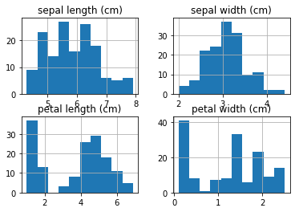
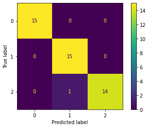

K nearest neighbors (knn) is a supervised machine learning model that takes a data point, looks at its 'k' closest labeled data points, and assigns the label by a majority vote. Here we see that changing k could affect the output of the model. In knn, k is a hyperparameter. A hyperparameter in machine learning is a parameter whose value is set before the learning process begins.

K nearest neighbors can also be used for regression problems. The difference lies in prediction. Instead of a majority vote, knn for regression makes a prediction using the mean labels of the k closest data points.

The famous iris database, first used by Sir R. A. Fisher, is perhaps the best known dataset to be found in pattern recognition literature. There are 150 iris plants, each with 4 numeric attributes: sepal length in cm, sepal width in cm, petal length in cm, and petal width in cm.

``` py
import pandas as pd
from sklearn import datasets
#iris = pd.read_csv('./data/iris.csv')
# import some data to play with
iris = datasets.load_iris()
df_iris = pd.DataFrame(iris.data, 
columns=iris.feature_names)

df_iris.shape
```
```
(150, 4)
```

``` py
df_iris.head()
```

| |sepal length (cm)|	sepal width (cm)|	petal length (cm)|	petal width (cm)|
||||||
|0|	5.1|	3.5|	1.4|	0.2|
|1|	4.9|	3.0|	1.4|	0.2|
|2|	4.7|	3.2|	1.3|	0.2|
|3|	4.6|	3.1|	1.5|	0.2|
|4|	5.0|	3.6|	1.4|	0.2|


``` py
df_iris.describe()
```

| |sepal length (cm)|	sepal width (cm)|	petal length (cm)|	petal width (cm)|
||||||
|count|	150.000000|	150.000000| 150.000000|	150.000000|
|mean|	5.843333|	3.057333|	3.758000|	1.199333|
|std|	0.828066|	0.435866|	1.765298|	0.762238|
|min|	4.300000|	2.000000|	1.000000|	0.100000|
|25%|	5.100000|	2.800000|	1.600000|	0.300000|
|50%|	5.800000|	3.000000|	4.350000|	1.300000|
|75%|	6.400000|	3.300000|	5.100000|	1.800000|
|max|	7.900000|	4.400000|	6.900000|	2.500000|


``` py
print(df_iris.columns)
```
```
Index(['sepal length (cm)', 'sepal width (cm)', 'petal length (cm)',
       'petal width (cm)'],
      dtype='object')
```

``` py
import matplotlib.pyplot as plt

df_iris.hist()
plt.show()
```




In classifications, stratified sampling is often chosen to ensure that the train and test sets have approximately the same percentage of samples of each target class as the complete set.

``` py
from sklearn.neighbors import KNeighborsClassifier

X = df_iris[['petal length (cm)', 'petal width (cm)']]
y = iris.target

from sklearn.model_selection import train_test_split
X_train, X_test, y_train, y_test = train_test_split(X, y, test_size=0.30, random_state=1, stratify=y)

knn = KNeighborsClassifier(n_neighbors=5)

knn.fit(X_train,y_train)

```
```
KNeighborsClassifier(algorithm='auto', leaf_size=30, metric='minkowski',
                     metric_params=None, n_jobs=None, n_neighbors=5, p=2,
                     weights='uniform')
```

``` py
pred = knn.predict(X_test)

#First five predictions
pred[:5]
```
```
array([2, 0, 0, 1, 1])
```

## Probablility Prediction

Of all classification algorithms implemented in scikit learn, there is an additional method 'predict_prob'. Instead of splitting the label, it outputs the probability for the target in array form.

``` py
y_pred_prob = knn.predict_proba(X_test)
y_pred_prob[10:12]
```
```
array([[1. , 0. , 0. ],
       [0. , 0.2, 0.8]])
```

For example, the probability of the 11th flower being predicted an iris-setosa is 1, an iris-versicolor and an iris-virginica are both 0. For the next flower, there is a 20% chance that it would be classified as iris-versicolor but 80% chance to be iris-virginica. What it tells us is that of the five nearest neighbours of the 12th flower in the testing set, 1 is an iris-versicolor, the rest 4 are iris-virginica.

## Accuracy

``` py
knn.score(X_test,y_test)
```
```
0.9777777777777777
```
Under the module sklearn.metrics, function accuracy_score(y_true, y_pred) does the same calculation.

## Confusion Matrix

``` py
from sklearn.metrics import confusion_matrix
from sklearn.metrics import plot_confusion_matrix

confusion_matrix(y_test, pred)
plot_confusion_matrix(knn,X_test,y_test)
```
```
<sklearn.metrics._plot.confusion_matrix.ConfusionMatrixDisplay at 0x7fd70c24bcd0>
```


## K-fold Cross Validation

Previously we made train-test split before fitting the model so that we can report the model performance on the test data. This is a simple kind of cross validation technique, also known as the holdout method. However, the split is random, as a result, model performance can be sensitive to how the data is split. To overcome this, we introduce k-fold cross validation.

In k fold cross validation, the data is divided into k subsets. Then the holdout method is repeated k times, such that each time, one of the k subsets is used as the test set and the other k-1 subsets are combined to train the model. Then the accuracy is averaged over k trials to provide total effectiveness of the model. In this way, all data points are used; and there are more metrics so we don’t rely on one test data for model performance evaluation.

The simplest way to use k-fold cross-validation in scikit-learn is to call the cross_val_score function on the model and the dataset.

``` py
from sklearn.model_selection import cross_val_score
# create a new KNN model
knn_cv = KNeighborsClassifier(n_neighbors=3)
# train model with 5-fold cv
cv_scores = cross_val_score(knn_cv, X, y, cv=5)
#print each cv score (accuracy)
print(cv_scores)
```
```
[0.96666667 0.96666667 0.9        0.93333333 1.   
```

``` py
#then, average
cv_scores.mean()
```
```
0.9533333333333334
```
As a general rule, 5-fold or 10-fold cross validation is preferred; but there is no formal rule. As k gets larger, the difference in size between the training set and the resampling subsets gets smaller. As this difference decreases, the bias of the technique becomes smaller.

## Grid Search

When we built our first knn model, we set the hyperparameter k to 5, and then to 3 later in k-fold cross validation; random choices really. What is the best k? Finding the optimal k is called tuning the hyperparameter. A handy tool is grid search. In scikit-learn, we use GridSearchCV, which trains our model multiple times on a range of values specified with the param_grid parameter and computes cross validation score, so that we can check which of our values for the tested hyperparameter performed the best.

``` py
from sklearn.model_selection import GridSearchCV
import numpy as np

# create new a knn model
knn2 = KNeighborsClassifier()
# create a dict of all values we want to test for n_neighbors
param_grid = {'n_neighbors': np.arange(2, 10)}
# use gridsearch to test all values for n_neighbors
knn_gscv = GridSearchCV(knn2, param_grid, cv=5)
#fit model to data
knn_gscv.fit(X, y)
#To check the top performing n_neighbors value
knn_gscv.best_params_
```
```
{'n_neighbors': 4}
```

``` py
#We can see that 4 is the best value for n_neighbors. 
#What is the accuracy of the model when k is 4
knn_gscv.best_score_
```
```
0.9666666666666668
```

By using grid search to find the optimal hyperparameter for our model, it improves the model accuracy by over 1%.

``` py
knn_final = KNeighborsClassifier(n_neighbors=knn_gscv.best_params_['n_neighbors'])
knn_final.fit(X,y)
y_pred=knn_final.predict(X)
knn_final.score(X,y)
```
```
0.9733333333333334
```
We can report that our final model, 4nn, has an accuracy of 97.3% in predicting the species of iris!

The techniques of k-fold cross validation and tuning parameters with grid search is applicable to both classification and regression problems.

## Label Prediction with New Data

``` py
new_data = np.array([3.76, 1.20])

new_data = new_data.reshape(1, -1)

knn_final.predict(np.array(new_data))
```
```
array([1])
```
Our model predicts that this iris is a versicolor.