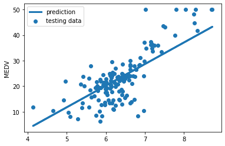
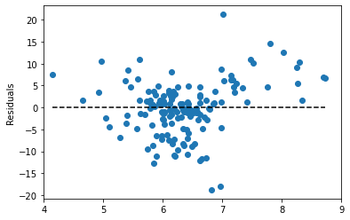

In scikit-learn, models require a two-dimensional feature matrix (X, 2darray or a pandas DataFrame) and a one-dimensional target array (Y).

Here we define the feature matrix as the column RM in boston and assign it to X. Note the double brackets around 'RM' in the code below, it is to ensure the result remains a DataFrame, a 2-dimensional data structure

Similarly, we define our target to be the column MEDV in boston and assign it in a variable called Y.

``` py
X = boston[['RM']]
print(X.shape)
```
```
(506, 1)
```

``` py
Y=boston['MEDV']
print(Y.shape)
```
```
(506,)
```

Recall that the single bracket outputs a Pandas Series, while a double bracket outputs a Pandas DataFrame, and the model expects the feature matrix X to be a 2darray.

## Univariate Linear Regression

``` py
from sklearn.linear_model import LinearRegression

model = LinearRegression()

from sklearn.model_selection import train_test_split

X_train, X_test, Y_train, Y_test = train_test_split(X, Y, 
  test_size = 0.3, 
  random_state=1)

print(X_train.shape)
print(X_test.shape)
print(Y_train.shape)
print(Y_test.shape)
```
```
(354, 1)
(152, 1)
(354,)
(152,)
```
To get an objective assessment on model’s predictive power, it’s important to keep the testing data unseen to the built model.

``` py
model.fit(X_train, Y_train)
```
```
LinearRegression(copy_X=True, fit_intercept=True, n_jobs=None, normalize=False)
```

Fitting is equal to training. It fits the model to the training data and finds the coefficients specified in the linear regression model, i.e., intercept and slope. After it is trained, the model can be used to make predictions.

### Parameter Estimates

The linear regression model has been fitted, what it means is that both parameters, the intercept and the slope, have been learned. What are they? In Scikit-learn, by convention all model parameters have trailing underscores, for example to access the estimated intercept from the model, rounded to the 2nd decimal place for better display.

``` py
print(model.intercept_.round(2))
print(model.coef_.round(2))
```
```
-30.57
[8.46]
```

The two parameters represent the intercept and slope of the line fit to the data. Our fitted model is MEDV = -30.57 + 8.46 * RM. For one unit increase in RM, the median home price would go up by $8460.

### Prediction

The predict() method estimates the median home value by computing model.intercept_ + model.coef_*RM.

Note that the input has to be 2-dimensional, either a 2darray or DataFrame will work in this case.

``` py
import numpy as np

new_RM = np.array([6.5]).reshape(-1,1) 
model.predict(new_RM)
```
```
array([24.42606323])
```


In addition, we can feed the testing set and get predictions for all homes.

``` py
y_test_predicted = model.predict(X_test)
print(y_test_predicted.shape)
type(y_test_predicted)
```
```
(152,)
numpy.ndarray
```

### Evaluating the Model

``` py
plt.scatter(X_test,Y_test,label='testing data')
plt.plot(X_test,y_test_predicted,label='prediction',linewidth=3)
plt.xlabel=('RM')
plt.ylabel('MEDV')
plt.legend(loc='upper left')
plt.show()
```



We can measure the distance between a point to the line along the vertical line, and this distance is referred to as residual or error. A residual is the difference between the observed value of the target and the predicted value. The closer the residual is to 0, the better job our model is doing.

Residual plots can reveal bias from the model and statistical measures indicate goodness-of-fit.

``` py
import matplotlib.pyplot as plt

residuals = Y_test -y_test_predicted
#plot residuals
plt.scatter(X_test,residuals)
#plot  horizontal line at 0
plt.hlines(y=0,xmin=X_test.min(),xmax=X_test.max(),linestyles='--')
#set xlim
plt.xlim((4,9))
plt.ylabel('Residuals')
plt.show()
```



We can also use the mean_squared_error() method under scikit-learn metrics

``` py
from sklearn.metrics import mean_squared_error

mse=mean_squared_error(Y_test,y_test_predicted)
print(mse)
```
```
36.517214730838624
```

In general, the smaller the MSE, the better, yet there is no absolute good or bad threshold. We can define it based on the dependent variable, i.e., MEDV in the test set. Y_test ranges from 6.3 to 50 with a variance 92.26. Compared to the total variance, a MSE of 36.52 is not bad.

To make the scale of errors to be the same as the scale of targets, root mean squared error (RMSE) is often used. It is the square root of MSE.

R-squared

It is the proportion of total variation explained by the model. Here, around 60% of variability in the testing data is explained by our model. Evaluating R-squared values in conjunction with residual plots quantifies model performance.


``` py
model.score(X_test,Y_test)
```
```
0.6015774471545622
```

## Multivariate Linear Regression

The extension from univariate to multivariate linear regression is straightforward in scikit-learn. The model instantiation, fitting, and predictions are identical, the only difference being the data preparation.

``` py
#Data preparation
X2=boston[['RM','LSTAT']]
Y=boston['MEDV']
#Trian test split
#Same random split to ensure The same splits
X2_train, X2_test, Y_train, Y_test = train_test_split(X2, Y, 
  test_size = 0.3, 
  random_state=1)
model2=LinearRegression()
model2.fit(X2_train,Y_train)
print(model2.intercept_)
print(model2.coef_)
y_test_predicted2 = model2.predict(X2_test)

mean_squared_error(Y_test,y_test_predicted2)
```
```
5.316818471096063
[ 4.12674118 -0.67762654]
28.93449134108657
```
In general, the more features the model includes the lower the MSE would be. Yet be careful about including too many features. Some features could be random noise, thus hurt the interpretability of the model.